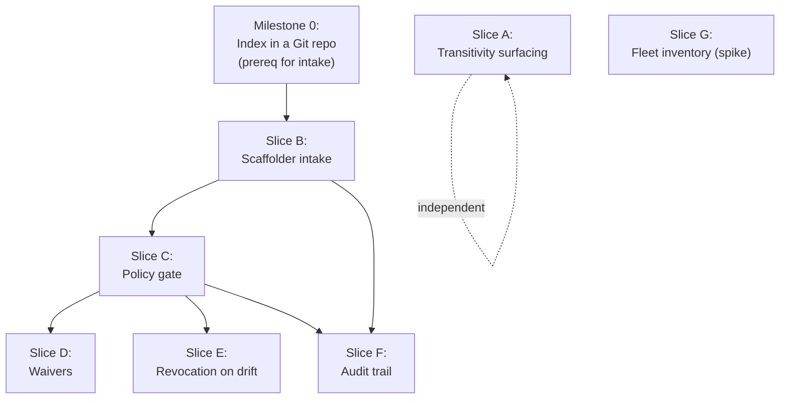

# Regis Backstage — Phase 3 (Intake & Governance) Decomposition Plan

> **For agentic workers:** This is a **parent / sequencing plan**, not a code-complete TDD
> plan. By explicit decision (2026-06-02), Phase 3 is **decomposed first**, and **each slice
> below gets its own `superpowers:brainstorming` pass** (to resolve the spec's open questions
> and lock its design) **before** a `superpowers:writing-plans` run produces its bite-sized,
> no-placeholder TDD plan. The deferral of code-level steps to per-slice plans is therefore
> **intentional**, not a placeholder gap. Slices use checkbox (`- [ ]`) syntax so milestones
> can be tracked; the code-complete `- [ ]` steps live in the per-slice plans.

**Goal:** Turn the read-only Phase 1/2 portal into an **image portfolio management portal** —
an intake & governance workflow (request → policy gate → admit/waive → re-evaluate) plus the
transitivity surfacing that is the product's differentiator.

**Architecture:** Everything rides on the **published report index** as the single write
surface. The merged Phase 2 `RegisEntityProvider` consumes that index as a **full mutation**
(drop an entry → the entity is deleted), so *"admit an image to the portfolio" == "merge a PR
that adds an index entry"*. Governance becomes **policy-as-code on index PRs**; the PR history
*is* the audit trail. Transitivity rides on the `dependsOn`/`dependencyOf` graph already minted
by Phase 2 — no new data, just traversal + surfacing.

**Tech Stack:** Backstage new frontend system (`@backstage/frontend-plugin-api`,
`/alpha` catalog blueprints), new backend system (`createBackendModule`, `coreServices`),
Backstage **Software Templates / Scaffolder** (new in Phase 3), the `regis-common` contract
(`validateReportIndex`, `ReportIndex`), Git/PR + CI for the gate, `regis analyze` (the scan,
reintroduced as "driving Regis"), changesets.

**Source spec:** [`docs/superpowers/specs/2026-06-02-regis-backstage-portfolio-personas-usecases.md`](../specs/2026-06-02-regis-backstage-portfolio-personas-usecases.md)
**Companions:** [`plugin-design`](../specs/2026-06-01-regis-backstage-plugin-design.md) ·
[`entity-model`](../specs/2026-06-01-regis-backstage-entity-model-design.md) ·
[`frontend-surfacing`](../specs/2026-06-02-regis-backstage-frontend-surfacing-design.md)

---

## The keystone: intake = a PR on the report index

The whole Management ambition reduces to one already-shipped mechanism:

- `plugins/regis-common/src/report-index.ts` defines the contract — `ReportIndex`,
  `IndexImageEntry`, `IndexPlaybookEntry`, `SUPPORTED_INDEX_SCHEMA_VERSION`,
  `validateReportIndex()`.
- `plugins/regis-backend/src/provider/RegisEntityProvider.ts` (`RegisEntityProvider`,
  wired by `catalogModuleRegisEntityProvider` in `module.ts`) reads that index and emits a
  **full mutation** over `EntityProviderConnection`. An entry present → entity minted; an
  entry removed → entity deleted.
- `app-config.yaml` (`regis.catalog.indexUrl`, default **unset**) points the provider at the
  published index; `examples/regis-index.json` is the shape reference.

**Consequence:** if the index is a file in a **Git repo**, then a **merged PR** is the only way
an image enters or leaves the portfolio. The Scaffolder opens the PR (UC6/UC7), CI is the
policy gate (UC8), the PR record is the audit trail (UC11), and a waiver is a structured field
on the entry (UC9). This is why Phase 3 needs **no new persistence for governance** — Git is
the store of record. (Report *history* still wants the Phase 2 Knex `ReportStore`, separate.)

---

## What already exists (each slice builds on these)

| Building block | Symbol / location | Consumed by |
| --- | --- | --- |
| Index contract + validator | `validateReportIndex`, `ReportIndex`, `IndexImageEntry` — `regis-common/src/report-index.ts` | B, C, D, F |
| Full-mutation provider | `RegisEntityProvider`, `catalogModuleRegisEntityProvider` — `regis-backend/src/{provider,module}.ts` | B, C, E |
| Scheduler re-scan | `coreServices.scheduler` → `createScheduledTaskRunner` in `module.ts`; `CatalogAggregator` warm | E |
| `dependsOn`/`dependencyOf` graph | minted image→playbook deps + user `Component`→image deps (entity-model spec) | A |
| Relation→refs helper + filters | `imageRefsFromRelations(entity, relationType)`, `isComponentWithImageDeps`, `isRegisPlaybook`, `isContainerImage` — `regis/src/components/imageRelations.ts` | A |
| Relation-reading card precedent (merged #6) | `RegisAliasesCard` + `aliasesCard` `EntityCardBlueprint` (filter `isContainerImage`) reading the `aliasOf` relation — `regis/src/components/RegisAliasesCard.tsx`, `plugin.tsx` | A (template for `RegisBlastRadiusCard`) |
| FE extension pattern | `EntityCardBlueprint`/`EntityContentBlueprint`/`PageBlueprint` in `regis/src/plugin.tsx` (`serviceImagesCard`, `playbookImagesCard`, `catalogPage`, …) | A, F |
| Report fetch/validate/cache | `ReportService`, `HttpReportSource`, `InMemoryTtlStore` — `regis-backend/src/service/` | C, E |
| `regis.io/*` vocabulary | annotations/labels + `scoreBand()` — `regis-common/src/catalog.ts` | B, C, D, E |

---

## Slice catalog

Each slice is **independently shippable working software**. "Open questions" are the spec items
that **must** be resolved in that slice's brainstorm before its TDD plan can avoid placeholders.

### Slice A — Transitivity surfacing  ⭐ differentiator, no governance questions

- [ ] **A. Blast-radius (UC12) + hardening-leverage (UC13) on the existing graph**

- **Goal:** From a base image, show the downstream services a CVE would hit (traverse
  `dependencyOf` upward) and the count of services a hardening fix would benefit.
- **Delivers:** a read-only entity card/page on `container-image` Resources (and a
  "blast-radius" view reachable from the catalog page).
- **Use cases:** UC12, UC13.
- **Builds on:** the `dependsOn`/`dependencyOf` graph (Phase 2) + `imageRefsFromRelations` +
  `isContainerImage`; the `RegisAliasesCard` relation-reading card (merged #6) is a near-exact
  template; new extension(s) registered in `regis/src/plugin.tsx`.
- **New surface (high level):** `regis/src/components/RegisBlastRadiusCard.tsx` (mirror the
  `RegisAliasesCard` pattern merged in #6: relation-reading card + `EntityCardBlueprint` with an
  `isContainerImage` filter) + a relation-traversal helper extending `imageRelations.ts`;
  possibly a backend traversal endpoint if client-side N+1 over `catalogApi` proves too chatty
  (decide in brainstorm).
- **Driving Regis?** No. Fully read-only.
- **Open questions for its brainstorm:** card vs dedicated page; traversal client-side
  (`catalogApi.getEntitiesByRefs`) vs a new backend `/blast-radius` endpoint; depth limit /
  cycle handling; how to render "services reachable" when components don't all declare
  `dependsOn` their image.
- **Definition of done:** on a base-image entity, the card lists downstream services with their
  owning team; on the catalog page, a base image shows a leverage count; tests with a fixture
  graph (base → 2 derived → 3 services) assert correct traversal + cycle safety.

### Slice B — Scaffolder intake template (the front door)

- [ ] **B. "Request image onboarding" template → PR on the index**

- **Goal:** A self-service Backstage Software Template that collects an image ref (+ metadata,
  + **mandatory owner/sponsor for third-party**) and opens a PR adding an `IndexImageEntry`.
- **Delivers:** a working Scaffolder template that produces a valid index PR.
- **Use cases:** UC6 (first-party), UC7 (third-party admission).
- **Builds on:** `ReportIndex`/`IndexImageEntry` shape + `validateReportIndex`; the index Git
  repo (see Milestone 0).
- **New surface:** a `template.yaml` (Scaffolder) + a custom field/action if needed to validate
  the entry against `validateReportIndex` before the PR; demo wiring in `examples/`.
- **Driving Regis?** Indirectly — the PR triggers a scan in CI (Slice C owns the scan).
- **Open questions for its brainstorm:** raw index-PR UX vs fully hidden behind the template
  (spec open Q); first-party vs third-party form variants; owner/sponsor capture UX; which
  fields are user-supplied vs derived; one template with a type toggle vs two templates.
- **Definition of done:** running the template against a test index repo opens a PR whose diff
  is a single valid `IndexImageEntry`; third-party path **refuses to submit without an owner**;
  template registered + demo'd.

### Slice C — Policy gate + owner enforcement (driving Regis)

- [ ] **C. Policy-as-code check on index PRs**

- **Goal:** A CI check on the index repo that ingests the Regis scan result for the PR's entry
  and enforces the bar: **auto-approve Gold / actionable-reject Bronze / flag Silver for human
  review**, and **require an owner**.
- **Delivers:** a required status check (CLI/action) that gates merges on the index repo.
- **Use cases:** UC8 (+ enforces the UC7 owner rule the provider relies on).
- **Builds on:** `validateReportIndex`; `scoreBand()`/tier vocabulary; `ReportService` patterns
  for fetch+validate; `regis analyze` (the scan — reintroduces "driving Regis", explicitly out
  of scope in Phase 1/2).
- **New surface (high level):** a policy-check command (likely a small CLI in a new
  `plugins/regis-policy/` or a CI action) reading the changed entry + the produced
  `report.json`, applying the policy, and posting an actionable PR comment.
- **Driving Regis?** **Yes** — first slice to cross that boundary; the scan trigger/ingestion is
  designed here.
- **Open questions for its brainstorm:** governance posture **hard barrier vs paved road + light
  gate** (spec open Q, owner to confirm); **policy-as-code from day one vs a lightweight manual
  process first** (spec open Q); where the policy lives (config-as-code file in the index repo);
  who/what triggers `regis analyze` and where the resulting `report.json` is published.
- **Definition of done:** a PR adding a Gold entry passes automatically; a Bronze entry is
  rejected with a comment quoting the failing rules; a Silver entry is labelled for review; an
  ownerless entry fails; all paths covered by tests against fixture reports.

### Slice D — Waivers (time-boxed, justified)

- [ ] **D. Exception path honored by the gate**

- **Goal:** A structured, **expiring**, justified waiver that lets a below-bar entry through
  Slice C, recorded for audit.
- **Delivers:** waiver schema + gate honoring + expiry enforcement.
- **Use cases:** UC9.
- **Builds on:** Slice C (the gate reads the waiver); index entry shape.
- **New surface:** a waiver record (a field on `IndexImageEntry` and/or a sibling
  `regis.io/waiver*` annotation on the minted entity) + validation in `regis-common`; the gate
  in C checks expiry + justification presence.
- **Driving Regis?** No.
- **Open questions for its brainstorm:** waiver **record format and location** (inline on the
  index entry vs a separate `waivers.yaml`); who may grant; expiry semantics on re-scan;
  surfacing an active waiver (chip on the entity).
- **Definition of done:** a Bronze entry **with** a valid unexpired waiver passes the gate and
  shows a "waived until <date>" chip; an **expired** waiver fails the gate; tests cover grant /
  expiry / missing-justification.

### Slice E — Re-evaluation & revocation on drift

- [ ] **E. Scheduler-driven drift → notify / revoke / reopen**

- **Goal:** When an admitted image drifts (e.g. Gold → Bronze on a new CVE), take action rather
  than silently keep it admitted.
- **Delivers:** drift detection on the existing scheduler + a configured action.
- **Use cases:** UC10.
- **Builds on:** `coreServices.scheduler` / `createScheduledTaskRunner` + `CatalogAggregator`
  (both already re-scan ~30 min); tier/score from the report.
- **New surface:** a drift detector in `regis-backend` comparing last-known vs current tier per
  entity, emitting a notification and/or opening a "reopen review" index PR.
- **Driving Regis?** Partially — re-scan already happens; this acts on its result.
- **Open questions for its brainstorm:** **automatic revoke vs auto-reopen a review** (spec open
  Q); **who is notified** (owner only? security?); notification channel (Backstage
  notifications plugin? webhook?); revoke == open a PR removing the entry (full-mutation delete)
  vs flag-in-place.
- **Definition of done:** simulating a tier drop in a fixture triggers the configured action
  (notification fired and/or reopen-PR drafted); no action on a stable tier; tests cover both.

### Slice F — Audit trail surfacing

- [ ] **F. "Who requested/approved what, when, on what basis"**

- **Goal:** Surface the intake history (≈ free from index-PR history) where governance personas
  look.
- **Delivers:** a thin audit view (per-image admission history; org-level intake log).
- **Use cases:** UC11.
- **Builds on:** the PR history of the index repo (Slices B/C); FE extension pattern.
- **New surface:** a backend reader over the index repo's PR/commit history (via the SCM
  integration already configured in Backstage) + a `regis/src/components/RegisAuditCard.tsx`.
- **Driving Regis?** No.
- **Open questions for its brainstorm:** data source (SCM API vs a generated `admissions.json`);
  retention; how much to show on the entity vs a dedicated page.
- **Definition of done:** an admitted image shows its admission PR (requester, approver, date,
  tier-at-admission); a global page lists recent admissions; tests against a fixture history.

### Slice G — Fleet inventory of unassessed images (research spike first)

- [ ] **G. Close the blind spot (unassessed images)**

- **Goal:** The Management ambition is the **whole fleet**, including images Regis has *not*
  assessed; the portal currently only knows reported images.
- **Delivers (spike → then build):** a source of "all images in use" reconciled against the
  index to reveal blind spots.
- **Use cases:** enables the "blind spots" framing behind UC3/UC4/leadership KPIs.
- **Builds on:** the catalog (`Component` → image `dependsOn`) + an external inventory.
- **Driving Regis?** Possibly (auto-scan discovered images).
- **Open questions for its brainstorm:** **where do unassessed images come from** (registry
  scan? CI inventory? cluster scan?) — spec open Q, currently **unanswered**; this is a
  **research spike** (the spec's "Assumptions to test") before committing to a build.
- **Definition of done (spike):** a documented, validated source of fleet image refs + a
  feasibility note; only then a build plan.

---

## Dependency graph & sequencing

**Recommended order:**

- [ ] **Milestone 1 — Slice A (transitivity).** Independent of intake, highest differentiator
      value, read-only. Start here while governance posture is still being decided.
- [ ] **Milestone 0 — Index Git repo.** Stand up the published index as a PR-accepting repo and
      point `regis.catalog.indexUrl` at it (config/ops; small generator). Prereq for B+.
- [ ] **Milestone 2 — Slice B (intake template).**
- [ ] **Milestone 3 — Slice C (policy gate).** The "driving Regis" boundary crossing — needs the
      governance-posture decision locked first.
- [ ] **Milestone 4 — Slice D (waivers).**
- [ ] **Milestone 5 — Slice E (revocation).**
- [ ] **Milestone 6 — Slice F (audit).**
- [ ] **Parallel — Slice G spike.** Run the research spike anytime; it gates the "whole fleet"
      scope and may reprioritise everything.

---

## Cross-cutting concerns (decide once, apply across slices)

- **Index repo & write access.** Milestone 0. Who hosts it, branch protection, the bot identity
  the Scaffolder uses to open PRs, how the built index is published to `indexUrl`.
- **Reintroducing "driving Regis".** Phase 1/2 were explicitly read-only; Slices C (and E)
  trigger/consume scans. Define the trigger + where `report.json` is published — once.
- **`regis.io/*` vocabulary extensions.** Intake will add keys (admission state, sponsor,
  waiver). Add them to `regis-common/src/catalog.ts` / `annotations.ts` consistently; design
  the exact keys in the owning slice's brainstorm (waiver format is an open question — don't
  pre-invent it here).
- **Third-party mandatory owner.** The provider **skips ownerless entities** (entity-model
  spec), so B (capture) and C (enforce) must guarantee an owner before merge — a workflow rule,
  not a nicety.
- **Posture default.** "Paved road + light gate" is *proposed, pending confirmation* — the
  single decision that most shapes Slices B/C. Confirm before Milestone 3.

---

## Self-review — coverage check

| Spec item | Covered by |
| --- | --- |
| UC6 onboard first-party | Slice B |
| UC7 admit third-party (+ owner) | Slice B + C |
| UC8 auto Gold / reject Bronze / review Silver | Slice C |
| UC9 time-boxed waiver | Slice D |
| UC10 drift → notify/revoke/reopen | Slice E |
| UC11 audit trail | Slice F |
| UC12 blast-radius | Slice A |
| UC13 hardening leverage | Slice A |
| Open Q: governance posture | Slice C brainstorm (+ cross-cutting) |
| Open Q: revoke vs reopen / who notified | Slice E brainstorm |
| Open Q: inventory of unassessed images | Slice G spike |
| Open Q: intake UX (raw PR vs hidden) | Slice B brainstorm |
| Open Q: policy-as-code day-1 vs lightweight | Slice C brainstorm |
| Open Q: owner/sponsor assignment UX | Slice B brainstorm |
| Assumptions to test (devs want selection; inventory reachable; index-PR UX) | Slice A (selection value), Slice G (inventory), Slice B (index-PR UX) |

Every UC6–UC13 maps to a slice; every spec open question is routed to a specific slice's
brainstorm or the cross-cutting list. No UC or open question is unowned.

---

## Per-slice execution workflow

For each slice, in milestone order:

1. **`superpowers:brainstorming`** on the slice — resolve its open questions, lock the design,
   produce/extend a slice-level spec.
2. **`superpowers:writing-plans`** on that slice's spec — produce the bite-sized, no-placeholder
   TDD plan (`docs/superpowers/plans/YYYY-MM-DD-regis-backstage-phase3-<slice>.md`).
3. **`superpowers:subagent-driven-development`** (or `executing-plans`) — implement with review
   checkpoints.

**Start point:** Slice A needs the lightest brainstorm (no governance questions), so it is the
fastest path to shipped Phase 3 value.
