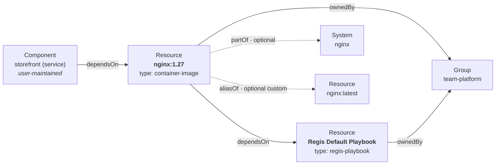

# Regis Backstage — Entity Model (Canonical Catalog Mapping)

> **Date**: 2026-06-01
> **Status**: Design approved (brainstorming), pending implementation plan
> **Scope**: The **canonical mapping** of Regis domain concepts onto the Backstage
> Software Catalog [system model](https://backstage.io/docs/features/software-catalog/system-model/).
> Companion to the plugin design (`2026-06-01-regis-backstage-plugin-design.md`).
> This defines the *target* model; **v1 (Phase 1 viewer) implements a documented
> subset**, and **Phase 2 (Approach C / entity provider) completes it**.

## Context & objective

The plugin design locked a phased delivery: a read-only **viewer** (v1) that overlays
Regis posture onto *existing* annotated catalog entities, with seams for a Phase 2
**`CatalogEntityProvider`** that mints first-class image entities. That design left the
*entity model* itself unspecified ("mint `Resource` (type `container-image`)").

This document fills that gap. The goal — chosen during brainstorming — is a
**reference mapping**: design the *correct, idiomatic* representation of Regis concepts
in the Backstage system model, even where v1 only implements part of it. It is meant to
be exemplary, because the plugin suite is a publishable OSS reference.

## Two layers — and why `Report` is not a catalog entity

The single most important framing: there are **two distinct models**, and Regis concepts
are deliberately split across them.

| Layer | Models | Regis concepts living here |
| --- | --- | --- |
| **Catalog model** (Backstage kinds/relations) | the **durable topology** — what you own and operate | the analyzed **image**, the **playbook** (standard), owners, systems, and the relations between them |
| **Plugin domain model** (`regis-common` types + REST API + store) | the **assessment data** | **`Report`** (the envelope), rules, badges, analyzer results, scores, and — Phase 2 — report **history** |

`Report` **is** a first-class concept — it is the `Report` interface in `regis-common`,
schema-validated, served by `GET /report`, and (Phase 2) persisted/historised in the
`ReportStore`. It is **deliberately not a catalog entity**. Rationale:

1. **Topology vs event.** The catalog models durable architectural entities (things you
   own). A report is a **time-stamped assessment event** — a snapshot, not a piece of
   topology. Events do not belong in the catalog graph.
2. **Cardinality / churn.** One report per CI run ⇒ thousands of ephemeral nodes. The
   catalog is not a time-series store. Report **history** is exactly what the Phase 2
   persistent `ReportStore` (Knex) exists for.
3. **No standard kind fits.** It would force a custom kind (rejected) or stretch
   `Resource` ("infrastructure") past breaking.
4. **Soundcheck precedent.** Check results / facts are never catalog entities; they live
   in the plugin store and are overlaid onto durable entities.
5. **"Latest report" semantics.** There is one *current* report per image ⇒ it is an
   **overlay of the image**, not a separate entity. A `Report` entity 1:1 with the image
   would be redundant (the image already carries tier/score/report-url). Its value only
   appears with **history**, which belongs to the store.

Everything below concerns the **catalog model** only.

## Locked decisions

| Axis | Decision |
| --- | --- |
| Image kind | **`Resource`**, `spec.type: container-image` (standard kind, custom type) |
| Scope | **Image + Playbook** entities (not just the image) |
| Playbook kind | **`Resource`**, `spec.type: regis-playbook` (standard kind — portable, no kind registration) |
| Posture location | **Pointers (annotations) + queryable summary (labels/tags)**; full report stays plugin data |
| Image ↔ Playbook link | **Native `dependsOn`** (image → playbook) |
| Identity | **Per analyzed ref** (`repo:tag`), *not* per digest; digest tracked in an annotation |
| Aliases | **Link, don't merge** — one entity per ref; group by digest; surface siblings as aliases |
| `Report` | **Plugin domain object**, not a catalog entity (see above) |
| Custom kinds | **None** — everything is a standard `Resource` |

## Entity model

### Image — `Resource` (`type: container-image`)

The analyzed container image is the subject of every report. Minted by the Phase 2
provider from the published index.

```yaml
apiVersion: backstage.io/v1alpha1
kind: Resource
metadata:
  name: library-nginx-1.27                 # sanitised from repo + tag (see Identity)
  namespace: default
  title: "nginx:1.27"                       # human-friendly
  description: "Container image library/nginx:1.27 (registry-1.docker.io)"
  labels:                                   # queryable → native catalog filters
    regis.io/tier: gold
    regis.io/score-band: "90-100"
  annotations:                              # pointers + exact / external values
    regis.io/report-url: https://trivoallan.github.io/regis/reports/nginx-1.27/report.json
    regis.io/image-ref: registry-1.docker.io/library/nginx:1.27   # authoritative identity
    regis.io/image-digest: "sha256:0000…"   # CONTENT identity, current (tracks the tag)
    regis.io/image-aliases: "library/nginx:1.27.0, library/nginx:latest"
    regis.io/score: "100"                   # exact, non-queryable
    regis.io/snapshot-date: "2026-05-31"
    regis.io/regis-version: "0.33.0"
    regis.io/playbook: resource:default/regis-playbook-default
  tags: ["regis:tier:gold"]                 # optional, for search
spec:
  type: container-image
  owner: group:default/team-platform        # index entry, or config fallback
  system: nginx                             # optional
  dependsOn:
    - resource:default/regis-playbook-default
```

### Playbook — `Resource` (`type: regis-playbook`)

The quality standard an image is assessed against. A durable, ownable, discoverable
concept — hence an entity (the brainstorming chose to model it explicitly).

```yaml
apiVersion: backstage.io/v1alpha1
kind: Resource
metadata:
  name: regis-playbook-default
  title: "Regis Default Playbook"
  description: "Quality standard images are assessed against"
  annotations:
    regis.io/playbook-id: default
    regis.io/playbook-version: "1.0.0"
spec:
  type: regis-playbook
  owner: group:default/team-platform
```

### Identity & naming

A Docker **tag is a mutable alias** to an **immutable digest**. The model keys identity
on the **analyzed ref**, not the digest:

- **`metadata.name`** is derived from the ref, **not** the digest (a `sha256:…` digest is
  71 chars and exceeds the 63-char name limit). One `Resource` **per analyzed ref**
  (`repo:tag`), updated in place when a new report arrives — consistent with the
  "latest report only" semantics.
- The **authoritative identity** is the `regis.io/image-ref` annotation (full canonical
  ref). The **content identity** is `regis.io/image-digest`, which **tracks the tag**:
  when the tag moves to a new digest, the *same* entity is updated (digest annotation +
  posture change); no new entity is created. The history of digest moves belongs to the
  Phase 2 `ReportStore`, not the catalog.

**Name derivation algorithm** (deterministic):

1. Take `repository` + `:` + `tag` (drop the registry from the name).
2. Lowercase; map any of `/ : @ +` to `-`; collapse repeated `-`. (`.` is a legal
   separator and is kept, so `1.27` survives.)
3. If the result is > 63 chars **or** collides with an existing name from a *different*
   `image-ref`, truncate to 54 chars and append `-` + the first 8 hex of
   `sha256(image-ref)`.

The registry is **not** in the name by default (kept in `image-ref`); operators may opt
into **namespace-per-registry** (registry → `[a-zA-Z0-9]` sep `-`, dots become dashes) to
disambiguate the same `repo:tag` across registries. Default namespace: `default`.

### Aliases — link, don't merge

When several analyzed refs resolve to the **same digest** (e.g. `nginx:1.27`,
`nginx:1.27.0`, `nginx:latest`):

- **One entity per ref** is kept (provenance preserved; no arbitrary "canonical" winner).
- The provider **groups index entries by `digest`** to compute alias sets (the report
  alone only knows its own ref + digest — alias detection is the provider's job).
- Siblings are surfaced via the **`regis.io/image-aliases`** annotation (primary,
  plugin-rendered as alias chips).
- **Optional graph enrichment**: a symmetric custom relation pair
  **`regis.io/aliasOf`** may be emitted by the provider. Caveat: custom relations do
  **not** render in the native Relations card, so the annotation remains the display
  source. Treated as a Phase 2 nice-to-have (see open questions).
- Aliases are **not** placed in `spec.dependsOn` (they are peers, not dependencies) —
  keeping the image's `dependsOn` clean (playbook only).

### Posture mapping

| Datum | Where | Why |
| --- | --- | --- |
| `tier` (gold/silver/bronze/none) | **label** `regis.io/tier` | queryable: `filter=metadata.labels.regis.io/tier=bronze` |
| `score` band | **label** `regis.io/score-band` | queryable bucket (exact numeric ranges can't filter on labels) |
| `score` exact | **annotation** `regis.io/score` | precise display value (annotations are free strings) |
| report URL, image-ref, digest, aliases, snapshot-date, regis-version, playbook ref | **annotations** | pointers / external-system references |
| failing tags, tier | **tags** (optional) `regis:tier:gold`, … | search / classification |
| rules, badges, analyzer results, `by_tag` breakdown | **plugin data** (`GET /report`) | rich/structured data — not catalog metadata |

`score-band` default buckets (configurable): `0-49`, `50-79`, `80-89`, `90-100`.

### Relations & ownership



| Relation | Mechanism | Source of truth |
| --- | --- | --- |
| Image `dependsOn` Playbook | native `spec.dependsOn` on the image | provider (from `playbook` in the index entry) |
| Component `dependsOn` Image | native `spec.dependsOn` on the **component** | the user-maintained component declares it |
| Image `ownedBy` Group | native `spec.owner` | index entry `owner` → fallback config `regis.catalog.defaultOwner` |
| Image `partOf` System | native `spec.system` (optional) | index entry `system` |
| Playbook `ownedBy` Group | native `spec.owner` | index playbook `owner` → fallback config |
| Image `aliasOf` Image | custom relation (optional) + `regis.io/image-aliases` annotation | provider (digest grouping) |

`spec.owner` is **required** on `Resource`. If neither the index entry nor
`regis.catalog.defaultOwner` supplies one, the provider logs and skips the entity (it
cannot mint an invalid entity) — so the config default is the recommended safety net.

## The `regis.io/*` vocabulary

These constants live in `plugins/regis-common/src/annotations.ts` (extending the existing
`REGIS_ANNOTATION_REPORT_URL = 'regis.io/report-url'`).

**Annotations** (free string values):

| Key | On | Meaning |
| --- | --- | --- |
| `regis.io/report-url` | image | URL of this image's `report.json` |
| `regis.io/image-ref` | image | full canonical analyzed ref (authoritative identity) |
| `regis.io/image-digest` | image | current resolved content digest (tracks the tag) |
| `regis.io/image-aliases` | image | comma-separated other refs sharing this digest |
| `regis.io/score` | image | exact integer score |
| `regis.io/snapshot-date` | image | ISO date of the report snapshot |
| `regis.io/regis-version` | image | version of regis that produced the report |
| `regis.io/playbook` | image | entityRef of the playbook the image was assessed against |
| `regis.io/playbook-id` | playbook | playbook identifier |
| `regis.io/playbook-version` | playbook | playbook semver |

**Labels** (queryable; value format `[a-z0-9A-Z]` sep `[-_.]`, ≤63):

| Key | Values |
| --- | --- |
| `regis.io/tier` | `gold` \| `silver` \| `bronze` \| `none` |
| `regis.io/score-band` | `0-49` \| `50-79` \| `80-99` \| `100` |

## The published report index (source) & provider

### Index contract

A new **versioned contract** (same discipline as `report.json`), registry-agnostic.
Carries *summaries* + *pointers*; the full report is fetched on demand.

```json
{
  "schemaVersion": 1,
  "playbooks": [
    { "id": "default", "title": "Regis Default Playbook", "version": "1.0.0",
      "owner": "group:default/team-platform" }
  ],
  "images": [
    { "imageRef": "registry-1.docker.io/library/nginx:1.27",
      "digest": "sha256:0000…",
      "reportUrl": "https://trivoallan.github.io/regis/reports/nginx-1.27/report.json",
      "tier": "Gold", "score": 100,
      "playbook": "default",
      "owner": "group:default/team-platform",
      "system": "nginx" }
  ]
}
```

Required per image entry: `imageRef`, `reportUrl`, `digest` (required for alias grouping).
Optional: `tier`, `score`, `playbook`, `owner`, `system`.

### `CatalogEntityProvider` behaviour

1. Fetch + **validate** the index (`schemaVersion` + schema) — same trust boundary as the
   report.
2. **Group `images` by `digest`** → compute alias sets.
3. Mint a `Resource` (`regis-playbook`) per `playbooks[]` entry.
4. Mint a `Resource` (`container-image`) per `images[]` entry: name from ref; labels
   `tier`/`score-band`; annotations (ref, digest, aliases, report-url, score,
   snapshot-date, regis-version, playbook); `spec.owner` (entry → config fallback),
   `spec.system?`, `spec.dependsOn: [<playbook ref>]`.
5. Emit as a **full mutation** — the provider *owns* these entities; an image dropped from
   the index is deleted from the catalog. Entities are marked
   `backstage.io/managed-by-origin: regis-provider://<index-url>`.
6. Refreshed by the **scheduler** (~30 min, matching the Phase 1 aggregator cadence).

## Phase 1 ↔ Phase 2 coherence

A report **describes an image** ⇒ canonically it **belongs to the image entity**.

- **Phase 1 (planned)**: no image entity exists. `regis.io/report-url` lives on an
  **existing** entity (often a user-maintained `Component` service); the plugin overlays
  posture there. *Tolerated*, but not the canonical carrier.
- **Phase 2**: the provider mints the image `Resource`, which becomes the **natural
  carrier** of `report-url`. The `Component` service merely `dependsOn` the image; on the
  service, an aggregate card ("images of this service") can sum the posture of the images
  it depends on.
- **Transition**: move the `report-url` annotation from the `Component` to the minted
  image `Resource`. Where both exist transiently, the plugin must avoid double display
  (prefer the image entity as the report carrier).

## Canonical vs v1

| Element | Canonical | v1 (Phase 1) | Phase 2 |
| --- | --- | --- | --- |
| `Resource` image (`container-image`) | ✔ | ✘ (annotates existing) | ✔ |
| `Resource` playbook (`regis-playbook`) | ✔ | ✘ | ✔ |
| Posture: `tier`/`score-band` labels + annotations | ✔ | `report-url` annotation only | ✔ |
| Relations `dependsOn` (image→playbook, service→image) | ✔ | ✘ | ✔ |
| Linked aliases (grouped by digest) | ✔ | ✘ | ✔ |
| Full report = plugin data (API) | ✔ | ✔ | ✔ |

The spec defines the **full canonical model**; v1 ships the **viewer subset** (already
planned in the Phase 1 plans); Phase 2 completes it via the provider.

## Edge cases

| Case | Behaviour |
| --- | --- |
| **Tag moves to a new digest** | Same entity updated (name stable; `image-digest` + posture change; alias set recomputed). History → `ReportStore` (Phase 2), not the catalog. |
| **Two refs, same digest** | Linked via `image-aliases` (+ optional `aliasOf`); never silently merged. |
| **Missing `digest` in an entry** | No alias grouping for it (treated as a singleton); provider logs a warning. |
| **Missing owner (entry + config)** | Entity is invalid (`owner` required) ⇒ provider logs and **skips**; recommend setting `regis.catalog.defaultOwner`. |
| **Name collision / > 63 chars** | Disambiguate with `-<8 hex of sha256(image-ref)>`; `image-ref` stays authoritative. |
| **Image removed from index** | Deleted via the full mutation. |
| **Playbook referenced but absent from `playbooks[]`** | `dependsOn` would dangle; provider mints a **stub** playbook `Resource` (id only) and warns. |
| **Phase 1 / Phase 2 double carrier** | Image entity is the canonical report carrier; plugin de-dupes display (see coherence). |

## Backstage constraints (verified)

From the descriptor format, well-known relations, and system model docs:

- **`metadata.name`**: `[a-z0-9A-Z]` separated by `[-_.]`, **≤63 chars**; case-insensitive
  uniqueness within kind/namespace.
- **`metadata.namespace`**: `[a-zA-Z0-9]` separated by `-`, ≤63; default `default`.
- **`labels`**: key = optional prefix (≤253) `/` name (`[a-zA-Z0-9]` sep `[-_.]`, ≤63);
  value = same format as `name`; intended for classifying values used in queries/filters.
- **`annotations`**: same key format; **values are unrestricted strings**; intended for
  references into external systems.
- **`tags`**: `[a-z0-9:+#]` separated by `-`, ≤63 each.
- **`Resource.spec`**: `type` (required), `owner` (required, Group/User ref), `system`
  (optional), `dependsOn`/`dependencyOf` (optional). `spec.type` has **no enforced
  meaning** — user-defined, which legitimises `container-image` and `regis-playbook`.
- **`dependsOn`/`dependencyOf`**: "needs the other entity to function" (e.g. service →
  storage); reference format `kind:namespace/name` (e.g. `resource:default/name`).
- **Custom relations** are allowed (the well-known list is explicitly non-exhaustive,
  extended via "Extending the model").

## Non-goals & open questions

**Non-goals** (deliberate):

- `Report` as a catalog entity (see "Two layers").
- Report **history/trends in the catalog** (belongs to the Phase 2 `ReportStore`).
- Modelling **rules / badges / tiers** as entities (they are report data).
- Authenticated index/report hosting (a Phase 2 `ReportSource` variant).

**Open questions** (for the implementation plan):

- Exact `score-band` thresholds (config-driven default proposed above).
- Whether to emit the optional custom `aliasOf` relation in Phase 2 or rely on the
  `image-aliases` annotation alone.
- Namespace-per-registry toggle: default off; ergonomics if enabled.
- Stub-playbook vs require-playbook-present policy for dangling references.
- Owner inheritance from the consuming `Component` (deferred; index/config for now).

## References

- Plugin design (companion): `docs/superpowers/specs/2026-06-01-regis-backstage-plugin-design.md`
- Contract types & annotations: `plugins/regis-common/src/types.ts`, `plugins/regis-common/src/annotations.ts`
- [Backstage — System Model](https://backstage.io/docs/features/software-catalog/system-model/)
- [Backstage — Descriptor Format](https://backstage.io/docs/features/software-catalog/descriptor-format/)
- [Backstage — Well-known Relations](https://backstage.io/docs/features/software-catalog/well-known-relations/)
- [Backstage — Entity Providers](https://backstage.io/docs/features/software-catalog/external-integrations/#custom-entity-providers)
- Inspiration: [Spotify Soundcheck](https://backstage.spotify.com/partners/spotify/plugin/soundcheck/)
