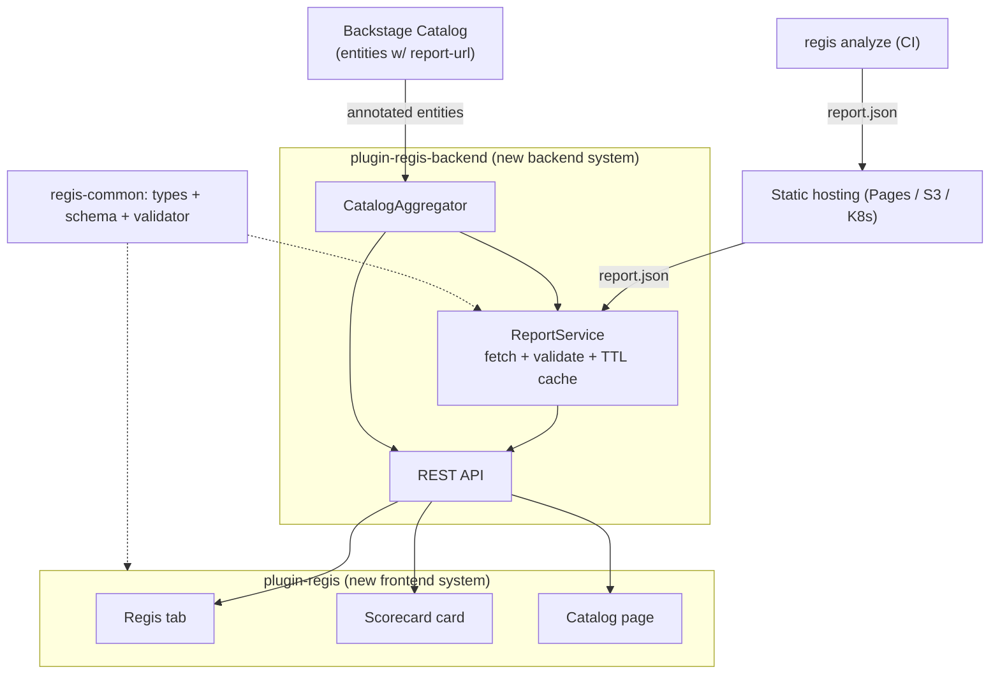
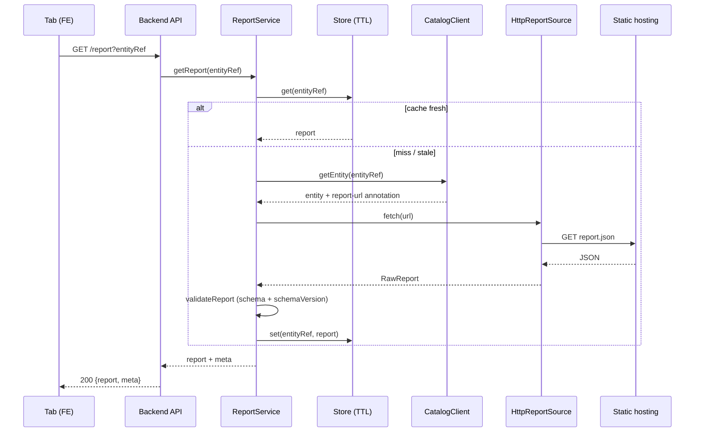
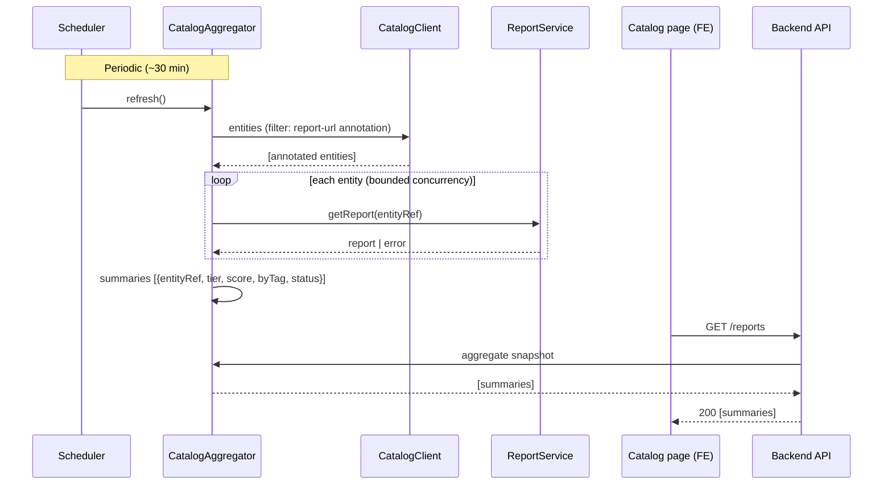

# Regis Backstage Plugin — Design

> **Date**: 2026-06-01
> **Status**: Design approved, pending implementation plan
> **Scope**: A new, standalone OSS reference plugin suite (`regis-backstage`), separate
> from the core `regis` repo. Builds on the dashboard-decouple contract
> (`report.json` + integer `schemaVersion`) shipped in PR #630.

## Context

Backstage is the de-facto open-source developer portal. Spotify's **Soundcheck**
plugin popularised surfacing tech-health/quality posture on catalog entities
(checks, tracks/certifications, scorecards). Regis already produces the raw material
for that story — a versioned `report.json` with rules, per-tag scores, an earned
`tier` (Gold/Silver/Bronze), and analyzer facts.

The 2026-06-01 **Dashboard Full Decouple** decision reframes the core as a producer
of a single versioned contract (`report.json` + `schemaVersion`), consumed at runtime
by any client. A Backstage plugin is, architecturally, **another consumer of that
exact contract** — exactly like the standalone `regis-dashboard`. This design makes
that consumer a first-class, idiomatic Backstage plugin.

## Decision

Build **Approach A — a read-only report viewer** as the v1 target, architected with
seams so the richer **Approach C** (catalog entity provider + persistence) can be
added later without rewriting the frontend or the API contract.

### Locked decisions (from brainstorming)

| Axis                | Decision                                                                                       |
| ------------------- | ---------------------------------------------------------------------------------------------- |
| Primary job         | **Report viewer** (read-only) — surface Regis posture inside the portal                        |
| Context             | **OSS reference plugin** — generic, publishable (npm), demoable; not tied to an internal stack |
| Report source       | **Annotation `regis.io/report-url`** → fetched by a backend plugin                             |
| Rendering           | **Backstage-native (MUI)** — reuse only the contract _types_, not UI                           |
| Surfaces            | **Entity tab** + **Overview scorecard card** + **global catalog page**                         |
| Approach            | **A for v1**, with seams for **C** (entity provider + persistence) as evolution                |
| Provider source (C) | **Published report index** (registry-agnostic, contract-driven)                                |
| API auth            | **Backstage default auth policy** (protected endpoints, user token)                            |
| Release tooling     | **changesets** (Backstage-ecosystem idiom)                                                     |
| Plugin system       | **New frontend system + new backend system** (both defaults as of Backstage v1.49, March 2026) |

### Goals

1. Show an image's Regis posture where developers already work — no context switch.
2. Be an **exemplary, publishable** Backstage plugin (idiomatic, declarative install).
3. Couple to the core **only** through `report.json` + `schemaVersion` — no other
   shared surface, independent release cadence.

### Non-goals (v1)

- **History / trends** — the source is a single URL, so v1 shows the _latest_ report.
  Multi-snapshot history arrives with the Phase 2 persistent store.
- **Driving Regis** (triggering analyses, editing playbooks) — viewer only.
- **First-class image entities** — v1 aggregates over _existing_ annotated catalog
  entities; minting `Resource` image entities is Phase 2 (C).
- **Authenticated report hosting** — v1 assumes the backend can read the report URL;
  injecting auth headers is a Phase 2 `ReportSource` variant.

## Architecture

A dedicated `regis-backstage` monorepo (standard Backstage layout: a demo app plus
publishable plugins). Four packages; the only live coupling to the core is
`report.schema.json`.

| Package                                 | Role                                                                                                                                                                                          |
| --------------------------------------- | --------------------------------------------------------------------------------------------------------------------------------------------------------------------------------------------- |
| `@regis/backstage-plugin-regis-common`  | **The contract** (isomorphic): TS types generated from `report.schema.json`, the embedded schema + a runtime validator, and annotation constants (`regis.io/report-url`). No UI/backend deps. |
| `@regis/backstage-plugin-regis`         | **Frontend** (new frontend system): entity tab, scorecard card, catalog page — all MUI-native.                                                                                                |
| `@regis/backstage-plugin-regis-backend` | **Backend** (new backend system): `ReportService` (resolve annotation → fetch → validate → TTL cache), `CatalogAggregator`, scheduler, REST API.                                              |
| `packages/app` + `packages/backend`     | **Demo** Backstage app — dev harness, e2e playground, OSS "try it" showcase.                                                                                                                  |

### Seams for the C evolution (no rewrite)

The backend depends on two interfaces so Phase 2 slots in behind them:

- **`ReportSource`** — `fetch(ref): Promise<RawReport>`. v1 impl: `HttpReportSource`
  (fetch a URL). Phase 2 adds a registry/OCI source and an auth-header variant.
- **`ReportStore`** — `get/set(key, report)`. v1 impl: `InMemoryTtlStore`. Phase 2
  adds a persistent Knex-backed store (enables history/trends).

Phase 2 also adds a `CatalogEntityProvider` that reads a **published report index**
and mints `Resource` (type `container-image`) entities. Frontend and REST contract
are unchanged.

## The contract: `report.json` + `schemaVersion`

The plugin consumes the existing, published envelope schema
`regis/schemas/report/report.schema.json`
(`$id: https://trivoallan.github.io/regis/schemas/report/report.schema.json`).
Relevant fields: `schemaVersion` (int, required), `version`, `snapshot_date`,
`tier`, `badges`, `links`, `request`, `results`, `rules`, `rules_summary`.

- **Types** are generated from this schema into `regis-common` (no hand-authored
  drift).
- **Runtime validation**: every fetched report is validated against the embedded
  schema and its `schemaVersion` checked against `SUPPORTED_SCHEMA_VERSION` before it
  enters the store — mirroring the decouple's "100% runtime, consumer-side" rule.
- A **future major** `schemaVersion` is rejected with an actionable message, never a
  silent broken render. An **older** compatible version renders best-effort (optional
  fields handled as absent).

## Components

### Frontend — `@regis/backstage-plugin-regis` (new frontend system)

| Extension (blueprint)                                   | Detail                                                                                                                                                                                                                                                           |
| ------------------------------------------------------- | ---------------------------------------------------------------------------------------------------------------------------------------------------------------------------------------------------------------------------------------------------------------- |
| `EntityContentBlueprint` — **Regis tab**                | Header (image ref, tier badge, snapshot date, score `Gauge`); rules **grouped by tag** (collapsible sections, `StatusOK/Warning/Error` per rule); analyzer facts (CVE counts table, OCI platforms); `badges` + `links`. Lazy-loaded; `useEntity` for the entity. |
| `EntityCardBlueprint` — **scorecard**                   | Compact `InfoCard`: tier badge + score `Gauge` + passed/failed counts + per-`by_tag` mini-bars + "View report" link. From `@backstage/plugin-catalog-react/alpha`.                                                                                               |
| `PageBlueprint` + `NavItemBlueprint` — **catalog page** | Filterable/sortable `Table`: entity, image ref, tier, score, failing tags. Fed by `GET /reports`.                                                                                                                                                                |
| `ApiBlueprint` — **`regisApiRef`**                      | Frontend API client (`discoveryApi` + `fetchApi`) that calls the backend.                                                                                                                                                                                        |

**Conditional display**: each entity extension declares a **`filter`** (e.g.
`hasAnnotation('regis.io/report-url')`) so the tab/card appear only on entities with
a Regis report — the declarative replacement for legacy `isRegisAvailable` +
`EntitySwitch`.

### Backend — `@regis/backstage-plugin-regis-backend` (new backend system)

- **`ReportService`** — orchestrates `ReportSource` + `ReportStore` + the common
  validator. Resolves an `entityRef` to its `report-url` annotation via `CatalogClient`.
- **`ReportSource`** (interface) → v1 `HttpReportSource`.
- **`ReportStore`** (interface) → v1 `InMemoryTtlStore` (bounded TTL).
- **`CatalogAggregator`** — via `CatalogClient`, lists annotated entities, resolves
  each through `ReportService` (cached), builds lightweight summaries. Warmed by the
  **scheduler** (`coreServices.scheduler`, ~30 min) and filled on demand.
- Wired via `createBackendPlugin` + `coreServices` (logger, scheduler, httpRouter,
  auth, discovery).

### Common — `@regis/backstage-plugin-regis-common`

Generated types (`Report`, `Rule`, `RulesSummary`, `Badge`, `RequestMeta`…);
`REGIS_ANNOTATION_REPORT_URL = 'regis.io/report-url'`; `validateReport(json)` (Ajv on
the embedded schema) + `SUPPORTED_SCHEMA_VERSION`; helpers `getRegisReportUrl(entity)`
and `isRegisAvailable(entity)`.

### REST API contract (FE ↔ BE — stable)

| Endpoint                  | Response                                                                                                                                      |
| ------------------------- | --------------------------------------------------------------------------------------------------------------------------------------------- |
| `GET /report?entityRef=…` | Latest report for one entity: `{ report, meta: { fetchedAt, source, schemaVersion } }`. `404` if no annotation; `422` if invalid/unsupported. |
| `GET /reports`            | Aggregate for the catalog page: `[{ entityRef, request, tier, score, byTag, status }]` (summaries, no heavy CVE `targets`).                   |
| `GET /health`             | Liveness probe.                                                                                                                               |

All endpoints sit behind Backstage's **default auth policy** (user token).

## Data flow

**Cache strategy**: the TTL `ReportStore` is the read source of truth — **warmed
periodically** by the scheduler (catalog page) and **filled on demand** (a freshly
opened entity tab). `schemaVersion`/schema validation happens **once**, at store entry.

### Flow 1 — single entity report (cache miss)

### Flow 2 — catalog page (scheduler + read)

The aggregator fan-out is **bounded** (e.g. 8 concurrent) to avoid hammering hosts.
A not-yet-refreshed entity shows `pending` on the page; its tab fills it on demand.

## Error handling & edge cases

Each report is isolated — a broken image never breaks a page — and the contract
(`schemaVersion` + schema) is the trust boundary.

| Case                                                                            | Behaviour                                                                                                                                     |
| ------------------------------------------------------------------------------- | --------------------------------------------------------------------------------------------------------------------------------------------- |
| **Annotation absent**                                                           | Not an error: tab/card hidden via `filter`. `GET /report` → `404` "no Regis report for this entity".                                          |
| **URL unreachable / timeout / host 404**                                        | Structured `502/504` (url + status). UI: `ResponseErrorPanel` with url, status, **Retry**. Short **negative cache** to avoid a re-fetch loop. |
| **Invalid JSON / schema mismatch**                                              | `422` with the offending field (Ajv errors). UI: "invalid report" + collapsible details.                                                      |
| **Unsupported major `schemaVersion`**                                           | **Distinct** `422`: "report schemaVersion=N, plugin supports ≤ M — upgrade the plugin". Actionable, not a crash.                              |
| **Older but compatible `schemaVersion`**                                        | Accepted; UI degrades on absent optional fields.                                                                                              |
| **Missing optional fields** (`tier` null, no `badges`, partial `rules_summary`) | Clean degradation: no tier badge, gauge hidden if no score, empty sections not rendered.                                                      |
| **Partial catalog page**                                                        | **Per-entity** resilience: a failed/pending entity shows a warning/unknown status; the page never crashes.                                    |
| **CORS**                                                                        | Non-issue: fetch is **server-side** (the backend). This is the backend's reason to exist.                                                     |
| **Auth-protected hosting**                                                      | v1: backend-readable URLs. _Phase 2: a `ReportSource` injects an auth header (config token)._                                                 |
| **Freshness**                                                                   | Bounded TTL; `meta.fetchedAt` surfaced ("fetched X ago") + **Refresh** forces a re-fetch.                                                     |

**Observability**: the backend logs every fetch failure (`entityRef` + url + status)
via the `logger` core service.

## Plugin-system choice — new frontend + new backend system

As of **Backstage v1.49 (March 2026)** the **new frontend system (NFS) is the
default**; the catalog plugin exposes first-class entity blueprints
(`EntityContentBlueprint`, `EntityCardBlueprint`). For a greenfield reference plugin,
NFS is the correct default — the legacy "more examples" argument is obsolete, and NFS
gives a **declarative install** (add the plugin → tab/card/page appear; placement
overridable via `app-config`) instead of forcing each consumer to hand-edit
`EntityPage.tsx`. Paired with the (already default) **new backend system**.

Known wrinkle: some catalog-react extension APIs are still exported under `/alpha`
(`@backstage/plugin-catalog-react/alpha`) — usable, evolving. Accepted.

## Testing strategy

| Level                     | Coverage                                                                                                                                                                                                                                 |
| ------------------------- | ---------------------------------------------------------------------------------------------------------------------------------------------------------------------------------------------------------------------------------------- |
| **Common**                | `validateReport`: valid fixture passes; invalid → targeted error; `schemaVersion` gating. Helpers `isRegisAvailable` / `getRegisReportUrl`.                                                                                              |
| **Backend (unit)**        | `ReportService` with fake `ReportSource`/`CatalogClient`: cache hit/miss, `422` schema, `422` version, `502` fetch. `CatalogAggregator`: N entities, bounded concurrency, per-entity resilience (one fails, others OK).                  |
| **Backend (integration)** | API routes via `startTestBackend` + `supertest`.                                                                                                                                                                                         |
| **Frontend**              | `renderInTestApp` + `TestApiProvider` (mock `regisApiRef`): rules grouped by tag, scorecard tier/score, error state (`ResponseErrorPanel`), surfaces hidden without annotation, **degraded report** (`tier` null) renders without crash. |

**Fixtures** (golden set, shared across levels): valid `report.json` (the core's
`report.v1.json`), an invalid one, a future-`schemaVersion` one, a degraded one
(`tier` null, no `badges`).

## Contract sync with the core

A `scripts/sync-contract.ts` pulls `report.schema.json` from the core (pinned
URL/version) and regenerates the TS types (`json-schema-to-typescript`) into
`regis-common`. The output is committed, with a **CI drift guard** (committed types
must match the schema). This is the only live coupling to the core — a versioned-file
dependency, not a pipeline dependency.

## Packaging, release & CI

- Build with the **Backstage CLI**; publish `@regis/backstage-plugin-regis`,
  `-backend`, `-common` to npm (semver via **changesets**).
- A README per plugin (install + config: annotation, `app-config` wiring, adding the
  tab/card/page) + an example `app-config.yaml` + OSS license.
- The `packages/app` demo doubles as dev harness, e2e target, and a "try it"
  showcase (example entities pointing at real Regis reports on GitHub Pages).
- **CI** (own repo, GitHub Actions): lint + typecheck + test + build + the
  **contract drift guard**. Conventional Commits (consistent with Regis).

## Phasing

### Phase 1 — Viewer (v1, Approach A)

- [ ] Scaffold `regis-backstage` monorepo (demo app + 3 plugins) on the Backstage CLI.
- [ ] `regis-common`: contract sync script, generated types, embedded schema +
      `validateReport`, annotation constants, drift guard in CI.
- [ ] Backend: `ReportSource`/`ReportStore` interfaces; `HttpReportSource`;
      `InMemoryTtlStore`; `ReportService`; `CatalogAggregator` + scheduler; REST API
      (`/report`, `/reports`, `/health`) under default auth.
- [ ] Frontend (NFS): `ApiBlueprint` (`regisApiRef`); `EntityContentBlueprint` tab;
      `EntityCardBlueprint` scorecard; `PageBlueprint` + `NavItemBlueprint` catalog
      page; annotation `filter`s.
- [ ] Error states + degraded-report handling per the table above.
- [ ] Tests at all levels + golden fixtures; demo app wired to live example reports.
- [ ] changesets + npm publish; per-plugin READMEs + example `app-config.yaml`.

### Phase 2 — Platform evolution (Approach C)

- [ ] `CatalogEntityProvider` reading a published report index → `Resource`
      (`container-image`) entities.
- [ ] Persistent `ReportStore` (Knex) behind the existing interface → history/trends.
- [ ] Auth-header `ReportSource` variant (config token) for protected hosting.
- [ ] Catalog page extended to first-class image entities + trend visualisations.

## Risks / watch-points

- **`/alpha` catalog-react APIs** — entity card/content blueprints partly under
  `/alpha`; pin Backstage versions and watch the changelog for the stable move.
- **Contract drift** — without the sync script + drift guard, decoupled cadences mean
  silent breakage. The drift guard is blocking in CI.
- **Aggregator cost** — `GET /reports` is O(N) fan-out fetches; mitigated by TTL cache
  - bounded concurrency + summaries-only payload. Revisit with the Phase 2 store if N
    grows large.
- **NFS maturity** — default since v1.49 but younger third-party ecosystem; the demo
  app is the canary that catches breakage early.
- **Scope creep toward C** — Phase 1 must ship the viewer end-to-end before any
  entity-provider/persistence work begins (the seams exist precisely to defer C).

## References

- Dashboard decouple design: `docs/superpowers/specs/2026-05-31-dashboard-full-decouple-design.md`
- Report envelope schema: `regis/schemas/report/report.schema.json`; contract fixture
  `tests/fixtures/report.v1.json`
- [Backstage — The Frontend System](https://backstage.io/docs/frontend-system/)
- [Backstage — Common Extension Blueprints](https://backstage.io/docs/frontend-system/building-plugins/common-extension-blueprints/)
- [Backstage — Integrate into the Software Catalog](https://backstage.io/docs/plugins/integrating-plugin-into-software-catalog/)
- [NFS becomes default — Roadie, Backstage Weekly #126](https://roadie.io/backstage-weekly/126-new-frontend-system-default-ai-context-idp-architecture/)
- Inspiration: [Spotify Soundcheck](https://backstage.spotify.com/partners/spotify/plugin/soundcheck/), [Backstage plugins](https://backstage.io/plugins/)
