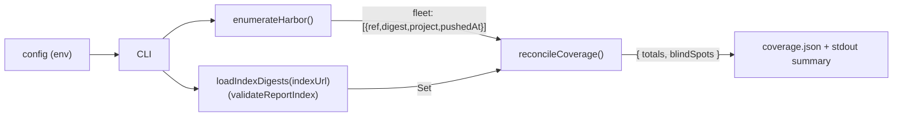

# Regis Backstage — Fleet Inventory Coverage (Phase 3 Slice G, spike) — Design

> **Date**: 2026-06-02
> **Status**: Design approved (brainstorming), pending implementation plan
> **Scope**: A **research spike** that measures how much of the container-image **fleet**
> (the registry storage footprint) is actually assessed by Regis — by enumerating a
> registry, reconciling against the published report index **by content digest**, and
> emitting a coverage report plus a feasibility note. **Read-only measurement only**; no
> catalog surfacing, no entity minting, no scan triggering. This is **Slice G** of
> `2026-06-02-regis-backstage-phase3-decomposition.md`; it answers the open question
> "where do unassessed images come from?" from
> `2026-06-02-regis-backstage-portfolio-personas-usecases.md`.

## Context & objective

The portal only knows images that already appear in the published report index (Phase 2's
`RegisEntityProvider` mints entities from it). The "image portfolio management portal"
ambition needs the **whole fleet, including unassessed images** — the security blind spots.
The personas/use-cases spec flagged this as an unresolved open question and explicitly
called for a **research spike** (its "assumptions to test, cheapest first") before any
build.

This document is that spike's design. Its **deliverable is knowledge**: a validated
inventory source and a feasibility note that informs a later *build* phase (which gets its
own brainstorm → plan). The implementation is therefore a deliberate **throwaway**.

## Locked decisions (2026-06-02 brainstorm)

| Axis | Decision |
| --- | --- |
| Fleet definition | **Registry storage footprint** (what is stored), not runtime/CI/catalog |
| Registry target | **Harbor / self-hosted `registry:2`** — Harbor API v2.0 as the primary (rich) path; generic Docker Registry v2 / OCI Distribution API as a **documented, un-built** fallback |
| Coverage unit | **Content digest** (`sha256:…`) — the immutable identity that tracks moving tags and maps to CVE exposure |
| Reconciliation | **Set difference on digest**: `{registry digests} \ {index digests}` = blind spots |
| Spike output | **Read-only coverage measurement** — a coverage report + a feasibility note. No surfacing, no entities, no action |
| Implementation shape | **Throwaway standalone CLI script** (brainstorm "Approach B"); the reusable `FleetInventorySource` interface is deferred to the build phase |

## Non-goals (deliberate)

- **No catalog surfacing** — no blind-spots page, no signal on entities, no minted
  "unassessed image" Resources. (That is the *build* phase, or Slice A/F surfacing.)
- **No "driving Regis"** — the spike never triggers a scan on a blind spot (that is Phase 3
  intake, Slices B/C).
- **No generic-v2 adapter implementation** — the script targets Harbor; the cost of the
  generic v2 path (`HEAD manifests` per tag) is *estimated* in the feasibility note, not
  built.
- **Not production code** — explicitly throwaway; optimised for fast learning, not reuse.
- **No persistence / history** — a single point-in-time measurement per run.

## Architecture

A single standalone **TypeScript CLI script**, run via `tsx`/`node`, living **outside
`plugins/`** (e.g. `scripts/fleet-inventory-spike/`). No Backstage wiring — no route, no
scheduler, no UI, no plugin module. Three internal units:

- **Harbor enumeration client** — talks to the Harbor API v2.0 (I/O).
- **Reconciler** — a **pure** function, no I/O.
- **CLI entry** — reads config, orchestrates, writes outputs.



## Components & data flow

- **Config (env vars; secrets never committed):** Harbor base URL, robot-account
  credentials, report-index URL, optional **project allow-list** (default: all projects),
  bounded **concurrency**, **page size**.
- **`enumerateHarbor()`** — Harbor API v2.0, which returns digests **without** per-tag
  manifest resolution:
  - `GET /api/v2.0/projects` → `GET /api/v2.0/projects/{project}/repositories` →
    `GET /api/v2.0/projects/{project}/repositories/{repo}/artifacts` (each artifact carries
    `digest`, `tags`, `push_time`, and — for image indexes — `references`).
  - Pagination via `page`/`page_size` (+ `Link` header); auth via **robot account** (HTTP
    Basic). Produces the fleet as `[{ ref, digest, project, pushedAt }]`.
- **`loadIndexDigests(indexUrl)`** — fetch the index, run **`validateReportIndex`**
  (`regis-common`), collect `images[].digest` into a `Set<string>`.
- **`reconcileCoverage(fleet, indexDigests)`** — **pure**: dedup the fleet by digest, then
  `blindSpots = fleetDigests \ indexDigests`; compute totals and coverage %.
- **Outputs** — `coverage.json` + a human-readable stdout summary.

## Digest granularity & multi-arch (the crux)

The coverage unit is the **tag-resolved artifact digest** = the **OCI image-index digest**
(manifest list), consistent with `regis.io/image-digest` ("current resolved content digest,
tracks the tag") from the entity-model spec. Per-platform child manifests are **not**
counted as separate units.

⚠️ **Primary risk to validate empirically** (this is the point of the spike): if Regis
records a **platform** digest while Harbor's artifact `digest` is the **index** digest, the
two will not match → a **false blind spot**. The note must report whether this happens in
practice. **Mitigation if it does:** also index Harbor's `references[].child_digest` so a
match at either level counts as covered.

## Reconciliation semantics

Matching is **pure digest-string equality**. Because a digest is a global content
identifier, registry host and ref-format differences (`registry-1.docker.io/library/nginx`
vs a Harbor project path) are **irrelevant** — no ref normalisation needed. A registry
digest absent from the index digest set is a **blind spot**; `imageRef` is carried only for
human-readable labelling of blind spots.

**Totals (precise),** over the **digest-deduped** fleet: `assessedDigests = |fleet ∩ index|`,
`blindSpots = |fleet \ index|`, `fleetDigests = assessedDigests + blindSpots`, and
`coveragePct = assessedDigests / fleetDigests` (defined as `0` when the fleet is empty).

## Error handling & edge cases

| Case | Behaviour |
| --- | --- |
| Auth failure (401/403) | Fail fast with an explicit message (which Harbor endpoint, robot identity) — do not emit a partial coverage figure that looks complete. |
| Pagination / rate-limit | Bounded **concurrency** + bounded **backoff/retry**; the observed limits go in the feasibility note. |
| Repository name with `/` | URL-encode the segment (`/` → `%2F`) for Harbor's artifact endpoint. |
| Dangling artifact (no tag) | Still counted **by digest** (it is stored content); `ref` shown as `<repo>@<digest>`. |
| Multi-arch index artifact | Counted once by its index digest; `references[].child_digest` recorded for the mitigation check. |
| Empty index / unsupported `schemaVersion` | `validateReportIndex` throws; the script exits with the validation error. |
| Same digest both sides, different ref | Non-problem — reconciliation matches the digest, not the ref. |
| Project allow-list excludes everything | Coverage over an empty fleet → report says so explicitly (no division-by-zero). |

## Outputs & the feasibility note (the deliverable)

**`coverage.json`:**

```json
{
  "generatedAt": "2026-06-02T12:00:00Z",
  "registry": "harbor.example.com",
  "totals": {
    "fleetDigests": 0,
    "assessedDigests": 0,
    "blindSpots": 0,
    "coveragePct": 0
  },
  "blindSpots": [
    { "digest": "sha256:…", "refs": ["project/repo:tag"], "project": "project", "pushedAt": "2026-05-01T00:00:00Z" }
  ]
}
```

Plus a one-screen **stdout summary** ("`harbor.example.com`: 128 fleet digests, 41 assessed
= 32% coverage, 87 blind spots").

**`FEASIBILITY.md`** (the real point of the spike) must answer:

- **Auth & access** — robot-account setup, scopes/permissions needed, gotchas.
- **Scale & cost** — projects × repos × tags enumerated, pages fetched, wall-clock,
  rate-limits observed; the **dedup-by-digest** saving (how many tags collapsed to one
  digest).
- **Multi-arch** — did the Regis-vs-Harbor **digest-alignment risk** materialise? Verdict +
  whether the `child_digest` mitigation was needed.
- **Generic-v2 fallback** — estimated cost of the portable `_catalog`/`tags/list`/`HEAD
  manifests` path (the N×M manifest calls) for registries without a Harbor-style API.
- **Recommendation for the build phase** — is registry-by-digest inventory viable as the
  `FleetInventorySource` reference adapter, and how should it be wired into the backend.

## Testing

Proportionate to a throwaway:

- **Unit** — `reconcileCoverage` is pure and gets a real test: digest set-difference, dedup
  (many tags → one digest), coverage %, multi-arch index (count once), and a moved-tag
  fixture (same ref, new digest → the new digest is a blind spot until reported).
- **I/O** — the Harbor enumeration is validated by **running the CLI against a real Harbor**
  and producing the feasibility numbers. That run *is* the spike; it is not mock-tested.

## References

- Decomposition plan (Slice G): `docs/superpowers/plans/2026-06-02-regis-backstage-phase3-decomposition.md`
- Personas & use cases (the open question): `docs/superpowers/specs/2026-06-02-regis-backstage-portfolio-personas-usecases.md`
- Entity model (digest semantics, `regis.io/image-digest`): `docs/superpowers/specs/2026-06-01-regis-backstage-entity-model-design.md`
- Index contract: `plugins/regis-common/src/report-index.ts` (`ReportIndex`, `IndexImageEntry`, `validateReportIndex`)
- [Harbor API v2.0](https://goharbor.io/docs/latest/build-customize-contribute/configure-swagger/) — projects / repositories / artifacts
- [OCI Distribution Specification](https://github.com/opencontainers/distribution-spec/blob/main/spec.md) — `_catalog`, `tags/list`, manifest digests (generic fallback)
