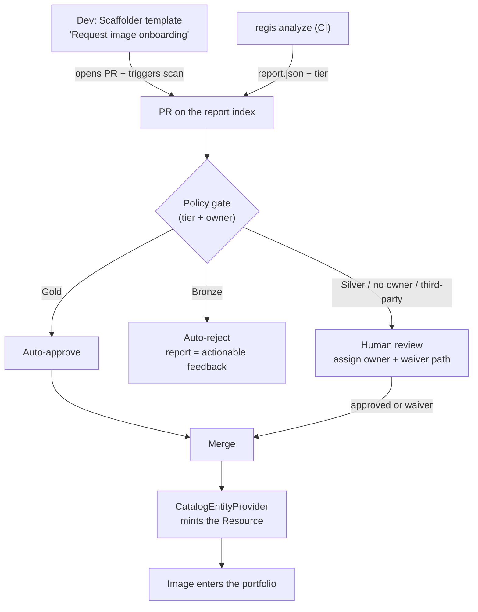
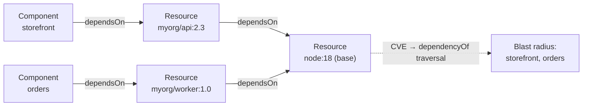

# Regis Backstage — Image Portfolio Portal: Personas & Use Cases

> **Date**: 2026-06-02
> **Status**: Product framing (from brainstorming). Personas & scope **decided**; the
> intake/governance posture has **open questions**. This informs the evolution of the
> plugin and entity-model specs — it is *not* itself an implementation plan.
> **Scope**: Who operates a Backstage instance configured with `regis-backstage` as an
> **image portfolio management portal**, and what for. Companion to
> `2026-06-01-regis-backstage-plugin-design.md` (how the plugin works) and
> `2026-06-01-regis-backstage-entity-model-design.md` (catalog mapping). Deliberately the
> *who/why/what* layer, upstream of the *how*.

## Context & objective

Regis is, in effect, **Soundcheck for container images**: it produces a versioned
`report.json` (earned `tier` Gold/Silver/Bronze, score, rules grouped by tag, CVE facts,
conformance to a *playbook*). The `regis-backstage` suite **surfaces** that posture inside
the portal (entity tab, scorecard card, catalog page; Phase 2 mints first-class image and
playbook entities).

The existing specs frame the suite as a read-only **viewer**. This document reframes the
*product ambition*: operating the portal as an **image portfolio management portal**, and
defines the personas and use cases that ambition implies.

The reframe forces one distinction that drives everything below:

| | **Visibility** (what is designed) | **Management** (the larger ambition) |
| --- | --- | --- |
| Scope | Images *already assessed* by Regis | The **whole fleet**, including unassessed images = the blind spots |
| Nature | Read-only, posture-centric | Inventory + lifecycle (EOL/deprecation) + **action** (admit, approve, reassign, re-scan) |
| Feasible | Now | Beyond Regis as-is |

**Anchor — the real jobs** (nobody wants to "manage a portfolio" for its own sake):
reduce supply-chain/security risk; reduce image sprawl; ship faster with trusted building
blocks; prove compliance. "Portfolio management" is the means.

## Locked decisions (2026-06-02 brainstorm)

| Axis | Decision |
| --- | --- |
| Centers of gravity | **Platform Engineer** (configures the portal, authors policy, curates golden images) **+ Application Developer** (consumes images + requests new ones) |
| Portfolio scope | **First-party (in-house) AND third-party (upstream)** images |
| Differentiator | Image **transitivity** (base → derived → services): CVE blast-radius + hardening leverage, via the `dependsOn` graph |
| Management ambition | **Yes** — go beyond the viewer with an **intake & governance** workflow |
| Intake mechanism | Scaffolder template → **PR on the published report index** → Regis scan + policy gate → merge mints the entity |
| Intake coverage | **Both** first-party and third-party (two policy flavors; third-party admission **must assign an owner/sponsor**) |
| Governance bar | **Policy-as-code**: auto-approve Gold / reject Bronze with actionable report / human review on Silver |
| Waivers | **Time-boxed + justified** exceptions — first-class, not an afterthought |
| Posture *(proposed, pending confirmation)* | **Paved road + light gate** (not a hard barrier) |

## Personas

★ = center of gravity.

| Persona | Job-to-be-done | Key surface | Tension / risk |
| --- | --- | --- | --- |
| ★ **Platform Engineer / golden-image curator** *(the operator who configures the instance)* | Make the trusted image the **easy default**; **author the policy** | `app-config`, playbooks, catalog page, the index | Becomes the bottleneck if every request is reviewed by hand |
| ★ **Application Developer** *(consumer + requester)* | Pick an approved building block / get my own image **admitted** fast | Catalog page (**selection** mode), scorecard on their component, intake template | Opaque or slow rejection → bypass (shadow images) |
| **Approver / governance authority** *(central once intake ships)* | Hold the bar, handle waivers, own the policy | Index PRs, policy-as-code, intake queue | Barrier vs paved road; rubber-stamp = theater |
| **Security / AppSec** | Fan-out CVE triage; measure **blast-radius** | Catalog filters, `dependsOn` graph | Incomplete inventory = security blind spot |
| **Engineering Manager / Tech Lead** | My team's posture + remediation backlog | Filter by `owner` | Depends on `spec.owner` (Phase 2) |
| **Compliance / Audit** | Prove assessment against the standard + trend | Audit trail of intake PRs, history | No history before the Phase 2 store |
| *Engineering leadership (steering)* | Portfolio KPI: % Gold, trend, risk concentration | Aggregate / dashboard | Trend = history = Phase 2 |

**Notes.** "Configure an instance" points literally at the **Platform** operator. The
**Developer** is the highest-leverage and most under-served persona in the current
viewer-centric design — their job is *selection* ("which approved base do I pick?"), not
*audit*; it turns the catalog page into a shopping surface. The **Approver** barely exists
until intake ships, yet the entire Management ambition revolves around them.

## Use cases

### Horizon 1 — Visibility (≈ current design, Phases 1–2)

| ID | Use case (user story) | Persona | Surface | Phase |
| --- | --- | --- | --- | --- |
| UC1 | Starting a service, I see approved base images and their tier, so I pick a trusted one without guessing | Dev | Catalog page (**shopping** mode) | P1/P2 |
| UC2 | See the posture of the image I use/own without switching tools | Dev / Manager | Entity tab + scorecard | P1 |
| UC3 | A CVE drops → filter the fleet by failing security rule / tier to prioritize | Security | Catalog filters | P1/P2 |
| UC4 | All my team's images + my remediation backlog | Manager | Filter by `owner` | P2 |
| UC5 | % of the fleet at Gold + trend | Leadership | Aggregate | P2 (trend needs history) |

### Horizon 2 — Management: intake & governance (the write phase)

| ID | Use case (user story) | Persona | Surface | Phase |
| --- | --- | --- | --- | --- |
| UC6 | Onboard the image of my new service into the portfolio | Dev | Scaffolder → index PR | P3 — quality gate on our output |
| UC7 | Get a third-party image (e.g. `bitnami/redis`) validated for use | Dev | Scaffolder → index PR | P3 — supply-chain admission + **mandatory owner/sponsor** |
| UC8 | Auto-approve Gold, actionable-reject Bronze, review Silver | Approver | Policy-as-code on the PR | P3 |
| UC9 | Get a **time-boxed, justified waiver** for an image below the bar | Dev requests / Approver grants | Index PR + waiver record | P3 |
| UC10 | An admitted image drifts (CVE → Bronze) → notify owner / revoke / reopen review | System + owner | Scheduler + notifications | P3 |
| UC11 | Who requested/approved what, when, on what basis | Compliance | Intake PR history (free audit trail) | P3 |

### Transversal — transitivity (the differentiator, on the `dependsOn` graph)

| ID | Use case (user story) | Persona | Surface | Phase |
| --- | --- | --- | --- | --- |
| UC12 | This CVE in `node:18` hits which downstream services? (blast-radius) | Security | `dependencyOf` traversal | P2 |
| UC13 | If I harden this base, how many services benefit? (hardening leverage) | Platform | `dependsOn` graph | P2 |

## The intake & governance workflow

This is the heart of the Management ambition — and it rides on the architecture already in
the specs. The entity-model spec states the Phase 2 `CatalogEntityProvider` reads a
**published report index** as a *full mutation* (drop an entry → the entity is deleted).
Therefore **"add an image to the catalog" = "add an entry to the index"**, and the request
workflow rides on the index:

**Design notes.**

- **The index PR *is* the governance workflow** — and the audit trail (UC11) for free.
- It **reintroduces "driving Regis"** (triggering a scan), explicitly out of scope for v1 —
  confirming intake is a **write phase after** the read-only Phase 2 provider.
- **Two flavors, one pipeline.** First-party = a quality gate on our own output; third-party
  = supply-chain admission control. A third-party image **arrives ownerless** → admission
  *must* assign an owner/sponsor, because `spec.owner` is required and the provider **skips
  ownerless entities** (entity-model spec). This is a workflow rule, not a detail.
- **Three make-or-break governance pieces:**
  1. **Policy-as-code bar** — don't hand-review every PR; the Platform job becomes *writing
     the policy*, not approving 40 requests.
  2. **Waivers** — without a time-boxed, justified exception path, people route around the
     portal → shadow images → you built friction, not governance.
  3. **Re-evaluation / revocation** — approval is not forever. The Phase 2 scheduler already
     re-scans (~30 min), so drift (Gold→Bronze) must trigger notify / revoke / reopen.
- **Posture** (proposed): *paved road + light gate*. The same Scaffolder can serve a hard
  barrier or a paved road — this is a posture choice, not a technical one. Aim for
  auto-approving the easy cases and reserving humans for the ambiguous middle + waivers,
  else the governance team becomes the bottleneck.

## Transitivity — the differentiator

Images are **not** services (the Soundcheck model): they are consumed **transitively** —
base image → derived images → services. A CVE in a base **propagates** down the tree. This
is value that neither Soundcheck nor the current viewer design exploits, and it is exactly
what Backstage's `dependsOn` graph expresses *if* components declare their images.

Enables **UC12** (blast-radius: traverse `dependencyOf` upward from the affected base) and
**UC13** (hardening leverage: count the services reachable from a base image).

## Open questions

- **Governance posture**: paved road + light gate (proposed) vs hard barrier — owner to
  confirm.
- **Revocation on drift (UC10)**: automatic revoke, or auto-reopen a review? Who is
  notified (owner only? security?).
- **Inventory completeness**: where do *unassessed* images come from (registry scan? CI
  inventory?) — Management needs the blind spots; Regis only knows reported images.
- **Intake UX**: is a raw index PR acceptable for a non-platform dev, or must it be fully
  hidden behind the template?
- **Volume**: does request volume justify policy-as-code from day one, or a lightweight
  process first?
- Owner/sponsor assignment UX for third-party admissions.

## Assumptions to test (cheapest first)

- Devs **want** a selection portal (vs copying a neighbor's Dockerfile). → Talk to 3-4 devs.
- The unassessed-image inventory is **reachable** (else the security blind spot persists). →
  Check registry/CI signals.
- **Index-PR-as-intake** is acceptable UX for a non-platform dev. → Prototype the template,
  test with one dev.

## Non-goals / deliberately set aside

- Cost/footprint management (image size, storage, pull bandwidth).
- SBOM / signed provenance beyond what Regis emits.
- Multi-registry ergonomics.
- `Report` as a catalog entity; report history *in the catalog* (already non-goals in the
  entity-model spec).

## Phasing (how this lands on the existing roadmap)

| Phase | Adds | Use cases |
| --- | --- | --- |
| **Phase 1 — Viewer** *(planned/shipping)* | Overlay posture on existing annotated entities | UC2; partial UC1/UC3 |
| **Phase 2 — Entity provider (read)** *(planned)* | First-class image/playbook entities; ownership; `dependsOn` graph; persistent store (history) | UC1, UC3, UC4, UC5, UC12, UC13 |
| **Phase 3 — Intake & governance (write)** *(new — this doc)* | Scaffolder template, index-PR workflow, policy-as-code, waivers, revocation, audit trail; reintroduces "driving Regis" | UC6–UC11 |

## References

- Plugin design (companion): `docs/superpowers/specs/2026-06-01-regis-backstage-plugin-design.md`
- Entity model (companion): `docs/superpowers/specs/2026-06-01-regis-backstage-entity-model-design.md`
- [Backstage — Software Templates (Scaffolder)](https://backstage.io/docs/features/software-templates/)
- [Backstage — Well-known Relations (`dependsOn`/`dependencyOf`)](https://backstage.io/docs/features/software-catalog/well-known-relations/)
- Inspiration: [Spotify Soundcheck](https://backstage.spotify.com/partners/spotify/plugin/soundcheck/)
