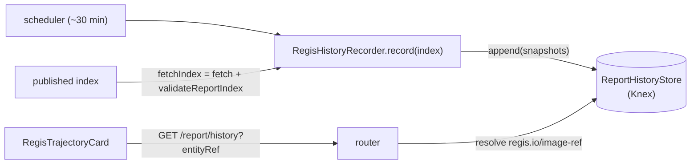

# Regis Backstage — Persistent Report History Store (Trends) — Design

> **Date**: 2026-06-02
> **Status**: Design approved (brainstorming), pending implementation plan
> **Scope**: The **Phase 2 persistent `ReportStore` (Knex)** that the plugin and
> entity-model specs repeatedly defer to — an **append-only time series of report
> snapshots per image**, plus the first surface on top of it: a **per-image score/tier
> trajectory card**. This is the data foundation for image trajectory, digest moves,
> portfolio trend, and drift detection; only the trajectory surface ships here.
> Companion to the [entity model](2026-06-01-regis-backstage-entity-model-design.md) and
> [plugin design](2026-06-01-regis-backstage-plugin-design.md).

## Context & objective

The plugin design promised, for Phase 2, a *"persistent Knex-backed store (enables
history/trends)"* behind the `ReportStore` seam, and the entity-model spec is explicit that
**report history — including the history of digest moves — belongs to this store, not the
catalog** (events vs topology). v1 (Phase 1) ships only the **latest** report, served from a
single URL and cached in an in-memory TTL store.

This document designs that persistent store. The four trend insights it must ultimately
serve (confirmed during brainstorming) all reduce to **one primitive — a per-image,
append-only series of posture snapshots**; they differ only in how that series is *queried
and surfaced*:

| Insight | How it reads the same series |
| --- | --- |
| **Per-image trajectory** (score/tier over time) | one image's snapshots, ordered by date |
| **Digest moves** (tag → new digest) | consecutive snapshots where `digest` differs |
| **Portfolio trend** (aggregate KPIs over time) | latest-per-image (or per-day) across all images |
| **Drift detection** (Phase 3 Slice E) | the latest two snapshots per image |

Because the storage is one shared primitive, this is a single coherent spec. To keep it
focused, **only the store + its write path + a history API + the per-image trajectory card
ship here**; the portfolio dashboard, a dedicated digest-moves view, and the drift hook are
explicitly **follow-on slices** that consume the same store.

## Locked decisions (2026-06-02 brainstorm)

| Axis | Decision |
| --- | --- |
| Primitive | **Append-only time series of posture snapshots, per image** |
| Identity / trajectory key | **`imageRef`** (canonical analyzed ref) |
| Write trigger | **Scheduler ← published index** (reuses the ~30 min provider cadence) |
| Dedup key | **`(imageRef, snapshotDate)`** — idempotent upsert |
| Dating | **Report-true `snapshotDate`** from the index when present; **fallback** to the scheduler run date (day granularity) until the regis-side generator supplies it |
| Payload | **Summary only** — `digest`, `tier`, `score`, `playbook`, `report_url`; **no `byTag`, no full report blob** |
| Store abstraction | **New, separate `ReportHistoryStore`** — *not* an extension of the cache `ReportStore` (distinct responsibility) |
| Write-path wiring | **Dedicated scheduled recorder task** in `module.ts`; shares a small `fetchIndex` helper with the provider (decoupled; a second index GET is negligible) |
| Surface (this spec) | **Per-image score/tier trajectory card** only |
| Out of scope (this spec) | Portfolio dashboard, digest-moves view, drift hook (follow-on slices) |

## Cross-repo dependency (the one external coupling)

The published index contract (`IndexImageEntry` in
`plugins/regis-common/src/report-index.ts`) currently carries
`imageRef, digest?, reportUrl, tier?, score?, playbook?, owner?, system?` — **no
`snapshotDate`**. To key snapshots on report-true dates, this spec **adds an optional
`snapshotDate?: string` (ISO date) to `IndexImageEntry`**:

- Adding an **optional** field is backward-compatible (no `SUPPORTED_INDEX_SCHEMA_VERSION`
  bump required for existing consumers; the index generator side, in the regis repo, must
  start emitting it for the precise dating to take effect).
- **Until the generator emits it**, the recorder **falls back to the scheduler run date**
  (day granularity). The store is therefore fully functional *before* the regis-side change
  lands, and silently gains precision once it does.

This is the only dependency outside this repository, and it is deliberately non-blocking.

## Data model & schema

A single table, created via a Knex migration (under
`plugins/regis-backend/migrations/`) using the standard `coreServices.database` (Knex)
client.

**Table `regis_report_snapshots`:**

| Column | Type | Null | Note |
| --- | --- | --- | --- |
| `image_ref` | text | no | trajectory identity (canonical analyzed ref) |
| `snapshot_date` | text (ISO date) | no | report-true when the index supplies it; else scheduler run date |
| `digest` | text | yes | content identity — powers digest-move detection |
| `tier` | text | yes | `gold` \| `silver` \| `bronze` \| `none` |
| `score` | integer | yes | 0–100 |
| `playbook` | text | yes | playbook id the image was assessed against |
| `report_url` | text | yes | pointer to the report (may be overwritten upstream) |
| `recorded_at` | text (ISO datetime) | no | scheduler observation time |

- **Unique constraint `(image_ref, snapshot_date)`** → idempotent upsert; re-observing the
  same snapshot refreshes values without creating duplicates.
- **Secondary index on `image_ref`** for trajectory queries.
- No `byTag`, no report blob (locked). Tag-level / full-report drill-down, if ever wanted,
  fetches the *current* report via the existing `GET /report`.

## Components & data flow



### `fetchIndex(url)` — shared helper

Extract the provider's current `source.fetch(url)` + `validateReportIndex(raw)` into a
small reusable helper (`plugins/regis-backend/src/service/fetchIndex.ts` or similar), so the
provider and the recorder share one validated-index code path. No behaviour change to the
provider; pure refactor in service of DRY.

### `RegisHistoryRecorder`

- `record(index: ReportIndex): Promise<void>` — for each `images[]` entry, derive
  `snapshotDate = entry.snapshotDate ?? runDate()` (day granularity) and upsert a snapshot
  row. Entries missing `digest`/`score` are still recorded (those columns are nullable).
- A pure mapping function `toSnapshots(index, runDate)` is the unit-tested core; the I/O
  (fetch + store write) is the thin shell.

### `ReportHistoryStore` (interface) + implementations

```ts
export interface Snapshot {
  imageRef: string;
  snapshotDate: string;   // ISO date
  digest?: string;
  tier?: string | null;
  score?: number;
  playbook?: string;
  reportUrl?: string;
  recordedAt: string;     // ISO datetime
}

export interface ReportHistoryStore {
  append(snapshots: Snapshot[]): Promise<void>;        // idempotent upsert by (imageRef, snapshotDate)
  getByImageRef(imageRef: string): Promise<Snapshot[]>; // ordered by snapshotDate asc
}
```

- `KnexReportHistoryStore` — production impl over `coreServices.database`.
- `InMemoryReportHistoryStore` — deterministic test impl.
- The existing cache `ReportStore` (`InMemoryTtlStore`) is **left unchanged**; only its
  misleading comment (*"Phase 2 adds a Knex impl"*) is corrected to point at this new,
  separate store — the cache and the history series are distinct responsibilities.

### Write-path wiring (`module.ts`)

A **dedicated scheduled task**, registered alongside the existing provider task, on the same
cadence (`regis.catalog.refreshMinutes`, default 30) and **only when `regis.catalog.indexUrl`
is configured** (same gate as the provider). It calls `fetchIndex(indexUrl)` then
`recorder.record(index)`. Independent of the provider's `EntityProvider` lifecycle.

## API

- **`GET /report/history?entityRef=<ref>`** — resolves the entity, reads its
  `regis.io/image-ref` annotation, returns `{ imageRef, snapshots: Snapshot[] }` ordered by
  `snapshotDate`. Mirrors the existing `/report` route style (`InputError` on a missing
  query param; auth via `httpAuth.credentials`).
- Returns an **empty `snapshots` array** when the entity exists but has no recorded history
  yet; the existing error map applies (`NoReportError`-style 404 only if the entity carries
  no `regis.io/image-ref` at all — reuse/extend the current mapping).
- A `ReportHistory` type (`{ imageRef: string; snapshots: Snapshot[] }`) is exported from
  `regis-common`, consistent with the existing `ReportEnvelope` / `ReportSummary` contract
  types.

## Surface — per-image trajectory card

- `plugins/regis/src/components/RegisTrajectoryCard.tsx`, registered via an
  `EntityCardBlueprint` filtered `isContainerImage` (same registration pattern as
  `RegisAliasesCard`, merged in #6).
- Data fetch follows the established **`RegisClient` + `useApi(regisApiRef)`** pattern (not
  the relation-reading pattern `RegisAliasesCard` uses, since history lives in the backend,
  not on the entity): add `getHistory(entityRef): Promise<ReportHistory>` to
  `plugins/regis/src/api/RegisClient.ts` and call it from the card.
- Rendering: a **dependency-free inline SVG sparkline** of `score` over time, with **tier
  transition markers** (e.g. a coloured dot where `tier` changes). No charting library is
  introduced in this foundation slice; a richer chart can be a follow-on if the sparkline
  proves insufficient.
- Explicit **loading / empty / error** states (empty = "no history recorded yet").

## Error handling & edge cases

| Case | Behaviour |
| --- | --- |
| `regis.catalog.indexUrl` not configured | Recorder task is a no-op (same gate as the provider) |
| Index invalid / unsupported `schemaVersion` | `validateReportIndex` throws; the run fails and logs; **no partial write** |
| `snapshotDate` absent from an entry | Fall back to the scheduler run date (day granularity); log once at debug |
| Entry missing `digest` | Snapshot recorded with `digest` null; no digest-move signal for it |
| Same `(imageRef, snapshotDate)` re-observed | Idempotent upsert — values refreshed, no duplicate row |
| Image dropped from the index | Historical snapshots are **retained** (history must survive entity deletion — that is the point of the store) |
| Entity without `regis.io/image-ref` | History API returns empty / 404; card shows the empty state |
| Tag moves to a new digest | A new snapshot with the new `digest` is appended on the next run; the move is the digest delta between consecutive snapshots |

## Testing

- **`toSnapshots` (pure)** — dedup intent, `snapshotDate` fallback to run date, null
  `tier`/`score`, and a moved-digest fixture (two snapshots, differing `digest`).
- **`ReportHistoryStore`** — `InMemoryReportHistoryStore` drives service/router tests;
  **one Knex integration test** (migration + idempotent upsert + ordered query) using the
  backend test DB harness **if one already exists in the repo** — otherwise a
  better-sqlite3 / in-memory Knex instance stood up in the test (decided in the plan).
- **Router** — `/report/history` resolves `image-ref`, returns ordered snapshots, empty
  array vs 404 paths.
- **Card** — multi-snapshot fixture asserts sparkline points + a tier-transition marker;
  loading / empty / error states.

## Non-goals & open questions

**Non-goals (deliberate):**

- Portfolio aggregate dashboard, dedicated digest-moves view, drift hook — follow-on slices
  on the same store.
- `byTag` history and full-report-blob history (locked to summary-only).
- Report history *in the catalog* (it belongs here, per the entity-model spec).

**Open questions (for the implementation plan):**

- **Retention / pruning policy.** v1 keeps everything (growth bounded by image × date). A
  configurable purge (e.g. drop snapshots older than N days, or keep last N per image) is a
  likely follow-on — not built here.
- **Backend test DB harness.** Whether the repo already has a Knex integration-test setup, or
  the plan stands up an in-memory one.
- **`snapshotDate` granularity.** Date (day) vs full timestamp once the regis generator emits
  it; day is assumed for the fallback and likely sufficient.

## References

- Entity model (history belongs to the store; digest semantics):
  `docs/superpowers/specs/2026-06-01-regis-backstage-entity-model-design.md`
- Plugin design (the `ReportStore` seam, "history/trends arrives with the Phase 2 store"):
  `docs/superpowers/specs/2026-06-01-regis-backstage-plugin-design.md`
- Cache store seam (left unchanged): `plugins/regis-backend/src/service/ReportStore.ts`
- Report service / source patterns: `plugins/regis-backend/src/service/ReportService.ts`,
  `ReportSource.ts`
- Index contract (gains optional `snapshotDate`): `plugins/regis-common/src/report-index.ts`
- Router style: `plugins/regis-backend/src/router.ts`
- FE card precedent + registration: `plugins/regis/src/components/RegisAliasesCard.tsx`,
  `plugins/regis/src/plugin.tsx`; FE backend-fetch client: `plugins/regis/src/api/RegisClient.ts`
- Contract types this extends: `plugins/regis-common/src/report-api.ts` (`ReportEnvelope`,
  `ReportSummary`)
