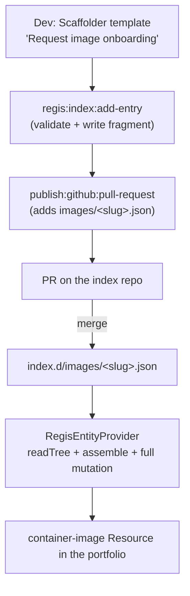

# Regis Backstage — Phase 3 Slice B (Scaffolder Intake) Design

**Status:** Approved (brainstorm 2026-06-03) — ready for `superpowers:writing-plans`.

**Goal:** A self-service Backstage Software Template that collects an image ref (+ metadata,
+ **mandatory owner/sponsor for third-party**) and opens a PR adding **one fragment file** to
the report index. Merging that PR mints the `container-image` Resource (full mutation).

**Source spec:** [`portfolio-personas-usecases`](2026-06-02-regis-backstage-portfolio-personas-usecases.md) (UC6 first-party, UC7 third-party admission).
**Parent / sequencing plan:** [`phase3-decomposition`](../plans/2026-06-02-regis-backstage-phase3-decomposition.md) (Slice B).
**Contract:** `plugins/regis-common/src/report-index.ts` (`ReportIndex`, `IndexImageEntry`, `validateReportIndex`).

---

## Scope note (expanded vs the original Slice B sketch)

The decomposition sketched Slice B as "just a Scaffolder template". Two brainstorm decisions
deliberately **widened** it:

- **Index storage becomes a directory of fragments** (one file per image) instead of a single
  `regis-index.json`. Motivation: each intake PR **adds a new file** → zero merge conflict on
  the intake path, and the slice's DoD ("diff = one valid `IndexImageEntry`") becomes literally
  the added file.
- **The provider reads the fragments directly** (no build/assembly step), via the Backstage SCM
  integration. This touches Phase 2 code (`RegisEntityProvider`).

The expansion is accepted. The full-mutation semantics and `buildEntities` stay **unchanged**:
the provider assembles a `ReportIndex` in memory from the fragments, then reuses the existing
pipeline.

---

## Architecture

Four changes, contract → UX:

1. **Fragment index model** — `regis-common` (validation + slug helpers) + example data.
2. **Provider reads fragments** — `regis-backend` (enumerate via `readTree`, assemble, validate).
3. **Custom scaffolder action** `regis:index:add-entry` — new `plugins/regis-scaffolder-backend`.
4. **Intake template** "Request image onboarding" — `examples/intake/`.



---

## Component 1 — Fragment index model (`regis-common`)

### Directory layout

Replaces the single `examples/regis-index.json`:

```
examples/regis-index.d/
  index.json            # { "schemaVersion": 1, "playbooks": [...] }  ← base, low churn
  images/
    <slug>.json         # one IndexImageEntry per file  ← intake writes here
```

- `index.json` holds `schemaVersion` + the `playbooks` array. **Intake never edits it** → the
  "zero conflict" property holds on the high-churn intake path.
- `images/<slug>.json` is exactly one `IndexImageEntry` JSON object.

### Slug

`slugForImageRef(imageRef: string): string` — deterministic sanitization:
`imageRef.replace(/[^a-zA-Z0-9._-]/g, '_')`.

- Used by **both** the action (filename + `reportUrl`) and any downstream report publisher
  (Slice C), guaranteeing intake ↔ publication consistency.
- Example: `registry-1.docker.io/library/nginx:1.27` →
  `registry-1.docker.io_library_nginx_1.27`.
- Collision risk (distinct refs sanitizing to the same slug) is low; a hash suffix is a noted
  hardening option, **out of scope** for Slice B.

### `reportUrl` derivation

`reportUrl = ${reportBaseUrl}/${slug}.json`. The entry is **schema-valid at PR time** (schema
requires `imageRef` + `reportUrl`). `tier` / `score` / `digest` / `snapshotDate` are left empty
and filled by the CI scan (Slice C). `reportBaseUrl` comes from action input
(`regis.intake.reportBaseUrl` in `app-config` is the template's default source).

### New `regis-common` exports

- `validateIndexImageEntry(input: unknown): IndexImageEntry` — validates a **single** entry
  against the `images.items` subschema (reuse the existing Ajv schema, compile the subschema).
  Throws an `IndexSchemaError`-style error on failure.
- `slugForImageRef(imageRef: string): string`.

Both reused by the action **and** the provider.

---

## Component 2 — Provider reads fragments (`regis-backend`)

### Enumeration abstraction

```ts
export interface IndexFragmentSource {
  /** Lists fragment files under the index directory. */
  list(indexDirUrl: string): Promise<Array<{ path: string; content: unknown }>>;
}
```

Two implementations:

- `UrlReaderFragmentSource` → `coreServices.urlReader.readTree(indexDirUrl)` (remote SCM, prod).
  Reads the tree, filters `*.json`, JSON-parses each.
- `FilesystemFragmentSource` → Node `fs` for `file://` URLs (local demo/dev). Unit-testable
  against a fixture directory.

The module selects the implementation by URL scheme (`file:` → filesystem, else UrlReader) and
injects `coreServices.urlReader` as a new dependency.

### Assembly + validation

Provider `run()` (replacing the single `fetchIndex` call):

1. `source.list(indexDirUrl)` → fragment files.
2. Read `index.json` → `schemaVersion` + `playbooks`.
3. For each `images/*.json`: `validateIndexImageEntry`. **Invalid fragment → skip + `logger.warn`**
   (resilience: one bad merged fragment must not blank the catalog).
4. Assemble `{ schemaVersion, playbooks, images }`, run `validateReportIndex` on the whole
   (defensive — after per-fragment validation it always passes), then `buildEntities` **unchanged**.
5. `applyMutation({ type: 'full', ... })` **unchanged** — removing a fragment removes its entity.

### Config migration

- `regis.catalog.indexUrl` (single file) → `regis.catalog.indexDirUrl` (directory).
- Update `app-config.yaml` + the demo comment to point at the local dir, e.g.
  `file://<repo>/examples/regis-index.d`.
- `module.ts`: the "indexUrl not set → provider disabled" guard becomes `indexDirUrl`.

---

## Component 3 — Custom scaffolder action (`plugins/regis-scaffolder-backend`)

New plugin (keeps entity-provider and scaffolder-action concerns separate). A backend module
(new backend system) registers the action via `scaffolderActionsExtensionPoint`.

`regis:index:add-entry`:

- **Inputs:** `imageRef` (required), `type` (`first-party` | `third-party`), `owner?`,
  `system?`, `playbook?`, `reportBaseUrl` (required), `indexDirPath` (required, e.g.
  `examples/regis-index.d`).
- **Logic:**
  1. If `type === 'third-party'` and no `owner` → fail with an actionable message (the provider
     skips ownerless entities — workflow rule, not a nicety).
  2. `slug = slugForImageRef(imageRef)`; `reportUrl = ${reportBaseUrl}/${slug}.json`.
  3. Build the `IndexImageEntry`; `validateIndexImageEntry` (fail early on invalid input).
  4. Write `${indexDirPath}/images/${slug}.json` (pretty JSON) into the scaffolder workspace.
- **Output:** `fragmentPath` (for the publish step / logging).
- **Duplicate handling:** best-effort — if `<slug>.json` already exists in the target repo the
  PR shows a modify diff (reviewer sees it). Explicit refusal is a noted hardening option, out
  of scope.

---

## Component 4 — Intake template (`examples/intake/template.yaml`)

"Request image onboarding":

- **Parameters:**
  - `imageRef` (string, required, `ui:autofocus`).
  - `type` (string enum `first-party` / `third-party`, required).
  - `system` (string), `playbook` (string).
  - `owner` — `OwnerPicker`; **conditionally required when `type === 'third-party'`** via
    JSON-schema `dependencies` / `oneOf` (the form refuses to submit a third-party request
    without an owner).
  - `targetRepo` — `RepoUrlPicker`, default = this repo.
- **Steps:**
  1. `regis:index:add-entry` (inputs from parameters + `reportBaseUrl` from template constant /
     config).
  2. `publish:github:pull-request` — opens the PR adding the single fragment file to
     `targetRepo`.
  3. `notification:send` — notify the requester.
  4. **Output:** link to the PR.
- Registered as a `file:` catalog location in `app-config.yaml` (mirror the existing
  `examples/template/template.yaml` registration).

---

## Testing strategy

- **`regis-common`:**
  - `validateIndexImageEntry` — valid entry passes; missing `imageRef`/`reportUrl` fails;
    wrong-typed `score` fails.
  - `slugForImageRef` — determinism; special chars (`/`, `:`, `@`) sanitized; idempotent.
- **`regis-scaffolder-backend`:**
  - Valid first-party input writes `images/<slug>.json` with the expected content + derived
    `reportUrl`.
  - Third-party **without** `owner` → action throws.
  - `reportUrl` derivation matches `slugForImageRef`.
- **`regis-backend`:**
  - `FilesystemFragmentSource` against a fixture dir (3 valid images + 1 corrupt fragment →
    corrupt skipped, 3 entities minted).
  - Provider assembles `index.json` + `images/*.json` → correct entity count.
  - Removing a fragment from the fixture → entity removed (full-mutation regression).
- **No real-scaffolder E2E** (out of scope); the action is covered by unit tests.

---

## Assumptions & dependencies

- **Milestone 0 (lightened):** no assembly step needed; what remains is pointing `indexDirUrl`
  at a real Git repo + a bot identity for opening PRs (ops, out of code-plan scope).
- **Slice C coupling:** `reportBaseUrl` is a Slice B knob; the *filling* of `tier`/`score` by
  the scan stays Slice C. Slice B produces a schema-valid-but-unscored entry.
- **GitHub integration:** `RepoUrlPicker` / `publish:github:pull-request` assume the GitHub
  integration already wired in `packages/backend` (it is).
- **`coreServices.urlReader`** is available in the new backend system (added as a provider dep).

---

## Out of scope (owned elsewhere)

- The CI scan / policy gate that fills `tier`/`score` and gates merge → **Slice C**.
- Waivers → **Slice D**. Drift/revocation → **Slice E**. Audit surfacing → **Slice F**.
- Provisioning the real index repo (branch protection, bot) → **Milestone 0 / ops**.
- Hash-suffixed slugs and explicit duplicate refusal → hardening, future.
